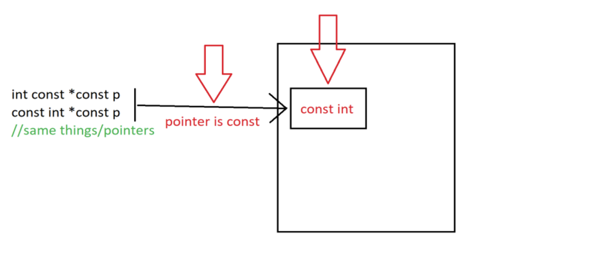

## Референция/Reference

Алтернативно име за съществуваща променлива. <br />
Променлива може да бъде декларирана като референция чрез ** & **.  <br />
Ако функция получи референция към променлива, тя може да променя(modify) стойността на променливата(директно).  <br />
Може да предотврати копирането на големи структури от данни.  <br />

```c++
void example1(int a)
{
    a += 5; //copy | no modification
}

void example2(int& a)
{
    a += 5; //by reference | modified
}

int main()
{
    int a = 5;
    example1(a); //copy
    example2(a); //a is passed by reference

    return 0;
}
```

Променлива, която притежава данните на вече съществуваща променлива. <br /> 
Референцията трябва да се инициализира още при дефиницията. <br />
Типът на референцията и на променливата трябва да съвпадат. <br />
След като веднъж е била декларирана, инициализирането е необратимо (обвързване за цял живот). <br />
При инициализация не се копират данните на оригиналната променлива, спестява се време и памет при огромни структури от данни. <br />

```c++
    //No reference
    unsigned int FamilyMoney = 100;
    unsigned int MomMoney = FamilyMoney;
    unsigned int FatherMoney = FamilyMoney;
    MomMoney -= 30;
    std::cout << MomMoney << ', '<< FatherMoney; //70, 100

    //with reference
    unsigned int FamilyMoney = 100;
    unsigned int &MomMoney = FamilyMoney;
    unsigned int &FatherMoney = FamilyMoney;
    MomMoney -= 30;
    std::cout << MomMoney << ', ' << FatherMoney; //70, 70
```

### Недостатъци на референцията
- Трябва да се инициализира при декларация.
- След като веднъж е била инициализирана, повече не може да се променя.

### Референция като параметър на функция:
- създава се нов обект, чиито данни са на адреса на формален параметър.
- няма копиране на данни.
- тъй като новият обект е пряко свързан с оригиналния, то каквито и промени да му направим, ние променяме и оригиналния.

```c++
void swap(double a, double b)
{
    double temp = a;
    a = b;
    b = temp;
}
//Нищо няма да се случи, защото a и b са нови временни обекти.
//Тези променливи НЕ СА свързани с променливите, които сме подали като параметри!!!
```

```c++
void swap(double& a, double& b)
{
    double temp = a;
    a = b;
    b = temp;
}
//Тези променливи СА свързани с променливите, които сме подали като параметри!!!
```

### Функция връщаща референция
- когато връщате референция, Вие не връщате стойността на променливата, а цялата променлива.
- трябва да сте сигурни, че променливата, чиято референция връщате, **съществува и следприключването на функцията**, тоест **не връщате локално създаден обект**.

```c++
int& errorProne()
{
    int a = 5;
    return a;
}
//Недефинирано поведение, което компилаторът на Visual Studio, любезно заличава, но реално това е проблем и не всички компилатори го позволяват
```

## Указател
Променлива, която пази адрес(memory address) като стойност. <br /> 
Променливата на указател сочи към типа данни, от същия тип, която е и тя, и се създава чрез оператор *. <br /> 
Адресът на променливата, с която работите, се присвоява на указателя. <br /> 

```c++
int number = 5;
int* ptr = &number;// A pointer variable, with the name ptr, that stores the address of number

// Output the value of number
std::cout << number << "\n";

// Output the memory address of number
std::cout << &number << "\n";

// Output the memory address of number with the pointer
std::cout << ptr << "\n";
```

Може да съдържа както адреса на някоя променлива, така и нулев адрес (nullptr) или някоя непозволена памет (което е източник на грешки). <br /> з
Адресът, който съдържа указателят, може да се променя. <br /> 
Може да се извършват промени по данните в съответния адрес. <br /> 
Указателят също притежава адрес. <br /> 

```c++
    //create pointer and set it to address of variable
    bool* engineer = nullptr; 
    bool plane1 = true;
    engineer = &plane1;

    //create another pointer and set it to point to the same address as the first pointer
    bool* gremlin = engineer;

    //decrement the value 
    (*gremlin)--;

    //set the value to true
    *engineer = true;

    //set value
    bool plane2 = *engineer;
    *gremlin = false;

    //set pointer to plane2's address
    gremlin = &plane2;

    //set value
    *engineer = 1;

    //set gremlin's value to opposite of engineer's value
    *gremlin = !(*engineer);
```

### Nullptr
- pointer literal(пойнтеров литерал).
- Не може да се вземе адреса му с &.
- nullptr сочи към адрес 0x00000000.

```c++
// function with integer argument
void fun(int N) 
{ 
    std::cout << "fun(int)\n";
}

// Overloaded function with char pointer argument
void fun(char* s)
{
    std::cout << "fun(char*)\n";
}

int main()
{
    fun(NULL);
}
//call of overloaded 'fun(NULL)' is ambiguous
```

### Указатели към константи/Константни указатели
Указателите към константа – НЕ може да се променя стойността на променливата, към която сочат.
- const int* - указател към константа
- int const* - указател към константа


Константните указатели са като референциите, но са указатели.
Може да се променя стойността на променливата, но НЕ може да се променя да сочи към друга променлива.
- int* const – константен указател



### Spiral Rule - Bjarne Stroustrup
Правилото гласи, започнете от името на променливата и се придвижваме по посока на часовниковата стрелка до следващия указател или тип.


```c++
const int * const == int const * const – константен пойнтър към константа

( int *) * const – константен пойнтър към пойнтър от тип int

( (int ) * const )* - пойнтър към константен пойнтър към int

( ( int const ) *) * - двоен пойнтър към константа от тип int

( ( int ) * const ) * const – константен пойнтър към константен пойнтър към int

( ( const int ) * const ) * const – константен пойнтър към константен пойнтър към константа от тип int
```

## Символен низ
Символен низ наричаме **последователност от символи**.
Последователност от 0 символи наричаме **празен низ**.
Представяне в C++ - масив от символи (char), който завършва със символа **'\0'**.

```c++
    char word[] = { 'H', 'e', 'l', 'l', 'o', '\0' };
    char word[6] = { 'H', 'e', 'l', 'l', 'o' }; //обикновен масив от символи
    char word[5] = { 'H', 'e', 'l', 'l', 'o' }; //обикновен масив от символи
    char word[100] = "Hello";
    char word[5] = "Hello"; //невалидно, понеже " "включват в себе си '\0‘
    char word[6] = "Hello";
```

### Tерминираща нула - \0
Първият символ в ASCII таблицата, с код 0 – т.е **char(0)**.
Брои се като елемент и **влияе** на размера на масив.
Използва се като **прекъсвач (терминатор)** от много функции за символни низове, за да се определя края на низа.

```c++
    //Може да се сложи в средата на масив от символи
    char a []= {'H', 'e', 'l', 'l','\0', 'o'}; //символният низ е “Hell”
```

### Инициализация

```c++
    //Чрез инициализатор
    char text[16] = {'C','+','+', '\0'};
    char sameText[] = {'C','+','+', '\0'};

    //Чрез литерал
    char sameTextAgain[] = "C++";
    char sameTextYetAgain[16] = "C++";
```

Пояснение: В информатиката под **литерал** се разбира константна стойност на променлива, зададена в сорс кода на дадена компютърна програма.

## Задачи:
1. Напишете имплементация на **strlen** - *връща колко символа има от началото до ‘\0’*

2. Напишете имплементация на **strcmp** - *сравнява 2 символни низа (> , = , <)*

3. Напишете имплементация на **strcat** - *конкатенация*

4. Напишете имплементация на **strcpy** - *копира source в destination*

5. Напишете имплементация на **аtoi** - *преобразуване на стринг в число*

6. Напишете имплементация на **searchInText** - *търсене в текст*.

7. Напишете импелментация на **getCharoOccurrencesCount** - *брой срещания на кнокретен символ в текст*.