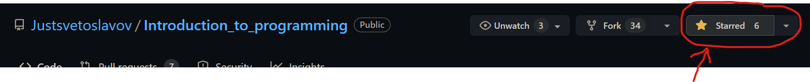
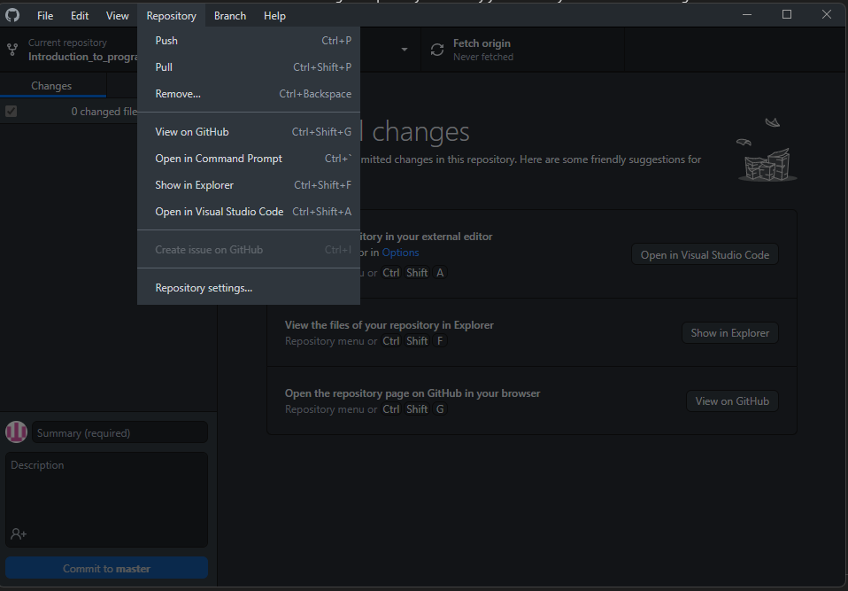
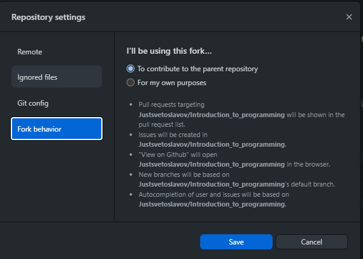
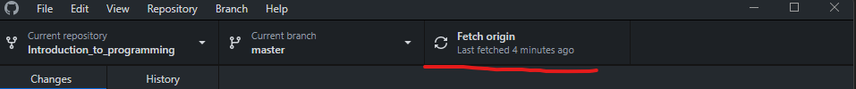

## Материали от семинари по „Увод в програмирането“
#### Зимен семестър 2025/2026, специалност „Информационни системи“

- [Тема 1:](https://github.com/Justsvetoslavov/Introduction_to_programming/tree/master/Sem.01) Увод. Примитивни типове данни. Преобразуване между типове. Оператори.
- [Тема 2:](https://github.com/Justsvetoslavov/Introduction_to_programming/tree/master/Sem.02) Условни конструкции - if, switch и тернарен оператор.
- [Тема 3:](https://github.com/Justsvetoslavov/Introduction_to_programming/tree/master/Sem.03) Цикли. Оператори break и continue.

## GitHub workflow

0. Star the repository


1. Fork the repository 
    - How to fork a repository: https://docs.github.com/en/get-started/quickstart/fork-a-repo

2. Clone your fork on your local machine 
    - How to clone a repository: https://docs.github.com/en/repositories/creating-and-managing-repositories/cloning-a-repository
    - In GitHub Desktop: Repository → Repository settings... → Fork behavior → select "To contribute to the parent repository"
        <table>
            <tr>
                <td align="left" valign="top"></td>
                <td align="right" valign="top"></td>
            </tr>
        </table>


3. Fetch origin regularly to keep your fork up to date
    - 

4. Create a branch 
    - You should create a new branch for each set of up to 3 tasks (or fewer if you are at the end of a practice set).
        - You may group per seminar or per consecutive tasks, but keep branches focused and not too large.
    - The branch must be created from the latest `master` branch of the original repository (pull / fetch first so you have the newest changes). *(If the repository switches to `main`, use that instead.)*
    - Useful resources:
        - [About branches.](https://docs.github.com/en/pull-requests/collaborating-with-pull-requests/proposing-changes-to-your-work-with-pull-requests/about-branches)
        - [How to create a branch.](https://docs.github.com/en/desktop/contributing-and-collaborating-using-github-desktop/making-changes-in-a-branch/managing-branches#creating-a-branch)

5. Add a solution for a task
    - Create a C++ (`.cpp`) file for each task.
    - **The name of the file should be `TaskXX.cpp` where `XX` is the zero‑padded task number (01–09, then 10, 11, ...)**
        - Examples: `Task01.cpp`, `Task02.cpp`, `Task12.cpp`.
    - Copy only the solution for that task into the file.

6. Commit the solution for each task
        - Commit only the file for that task.
        - **Each task must be in a separate commit.**
        - Repeat steps 5 and 6 until you have 3 task commits in the branch. <br />
            Then create a new branch and return to step 4 for the next set.
    - [About commits.](https://docs.github.com/en/desktop/contributing-and-collaborating-using-github-desktop/making-changes-in-a-branch/committing-and-reviewing-changes-to-your-project#about-commits)

7. Open a Pull Request (PR) to the original repository's `master` branch
    - How to create a pull request: https://docs.github.com/en/pull-requests/collaborating-with-pull-requests/proposing-changes-to-your-work-with-pull-requests/creating-a-pull-request
    - The Pull Request should merge the changes from your branch (in your fork) into the `master` branch of the original repository.
    - **The title of the Pull Request should be:**
        ```
        Seminar.\<number\>: Add \<first task number\> - \<last task number\> | \<name\>
        
        Example:
        Seminar.03: Add 01-03 | John Doe
        ```
    - **The description of the Pull Request should be:**
        ```
        \<name\> \<lastname\>
        \<group\> \<fn\>

        Example:
        John Doe 
        2 2MI0600192
        ```

| :boom: **DANGER** |
|:------------------|
| **If a Pull Request contains more than 3 tasks, or the title or the description are not in the required format, the PR will be rejected and not reviewed.** |
