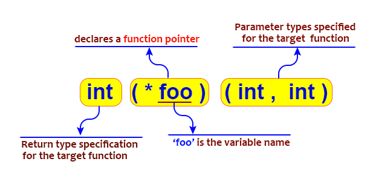

## **Указатели към функции**

Указателят към функция има за стойност адреса на изпълнимия код на дадена функция. <br />
Указателите към функции могат да се използват, за да се извикват функции и да се подават функции като параметри на други функции(функции от по-висок ред). <br />
Не може да се извършва указателна аритметика върху указатели към функции. <br />



#### **Пример чрез print function**
```c++
#include <iostream>

void HelloWorld()
{
    std::cout << "hello World\n";
}

int main()
{
    auto function = HelloWorld; //getting the function pointer/memory address of the function
                                //same as auto function = &HelloWorld

    void (*function2)() = HelloWorld;
    
    function(); //calls HelloWorld function
    function2();
}
```

**Keyword: auto** - декларира променлива, чийто тип се извежда от израза за инициализация в нейната декларация. <br />

#### **Пример чрез функция с параметри**
```c++
#include <iostream>

int Mult(int x, int y)
{
    return x * y;
}

int main()
{
    // Declaration of function pointer
    int (*funcptr)(int, int);

    // funcptr is pointing to mult function which multiplies two numbers
    funcptr = Mult;

    // Store the result obtained
    int mul = funcptr(5, 7);

    std::cout << "The value of the product is: " << mul << std::endl;
    return 0;
}
```

## **Функции от по-висок ред/High order functions**

### **Дефиниция**
Функция от по-висок ред ще наричаме функция, която приема друга функция като аргумент или връща функция като резултат.

#### **Function Pointer as Return Type**

```c++
#include <iostream>

// define the function pointer type
typedef int (*ptr)(int);
typedef ptr (*pointer)();

int Add(int x)
{
    std::cout << "from the add function!" << std::endl;
    return x + 5;
}
 
// function that returns a function pointer
ptr Print()
{
    std::cout << "The sum is: ";
    
    // function pointer is returned
    return &Add;
}
 
int main()
{
    // declare a variable
    int x = 45;
    
    // initialize a function pointer
    pointer n = Print;
    
    // invoke the pointer and pass the variable as an argument
    std::cout<< (*n())(x) << std::endl;
 
    return 0;
}
```

**Оператор typedef** - чрез него може да задаваме имена (синоними) на типове. ( oт C ) <br />
**Оператор using** - чрез него може да задаваме имена (синоними) на типове. ( от C++11 ) <br />

#### **Function pointer as parameter**

```c++
void Function( return_type_of_pointer (*pointer_name)(data_type1, data_type2. . .) )
{
    //code
}
```

```c++
#include <iostream>  

void Func1()  
{  
    std::cout << "func1 is called\n";  
}  

void Func2(void (*funcptr)())  
{  
    funcptr();  
}  

int main()  
{  
    Func2(Func1);  
    return 0;  
}  
```

```c++
#include <iostream>

// function declaration
int Func1()
{
    std::cout << "Function - 1 is called.\n";
    return 5;
}

// function that takes reference as an argument
int Func0(int(&F)())
{
    std::cout << "Function - 0 is called.\n";
    return F();
}

int main()
{
    int x = Func0(Func1);
    std::cout << "The value of x is: " << x << std::endl;
    return 0;
}
```

### **Предимства**
- Указател към функция може да бъде подаден като параметър на функция, като по този начин осигурява функционалността за прилагане на функции за обратно извикване(callback function).
- Указател към функция позволява да се изпращат инструкции как да се изпълни нещо.
- Като се предоставят указатели на функции като параметри, може да се конструират гъвкави функции и библиотеки, които позволяват на програмиста да определя конкретното поведението.

### **Заключение**
- Just like variables, functions also have pointers to them, that stores the address which points to the first instruction of the function in C++.
- The address of a function can be accessed by just writing the function name without the brackets.
- Callback functions are functions that are executed when a particular event takes place. This can be achieved by using a function pointer.
- A function pointer cannot be used to allocate or deallocate memory as they point to the address of the code.
- We can also call a function indirectly with the help of a pointer ( function pointer ) by using the name of the function pointer in C++.
- A function pointer can also be used as a return type or as an argument to another function.

## [Lambda functions](https://en.cppreference.com/w/cpp/language/lambda)
Т.нар анонимни функции - дефинират се еднократно на мястото, на което се използват (извикват или подават като параметър на функция). <br />

#### **Syntax**


#### **By-reference capture**
```c++
void f(int i)
{
    [&]{};          // OK: by-reference capture default
    [&, i]{};       // OK: by-reference capture, except i is captured by copy

    [&, &i] {};     // Error: by-reference capture when by-reference is the default
```

#### **By-copy capture**

```c++
void f(int i)
{
    [=]{};        // OK: by-copy capture default
    [=, &i]{};    // OK: by-copy capture, except i is captured by reference

    [i, i] {};          // Error: i repeated
    [i] (int i) {};     // Error: parameter and capture have the same name
}
```

**[Допълнително информация: Статия за предимства на Lambda функция в С++.](https://www.cppstories.com/2020/05/lambdasadvantages.html/)**