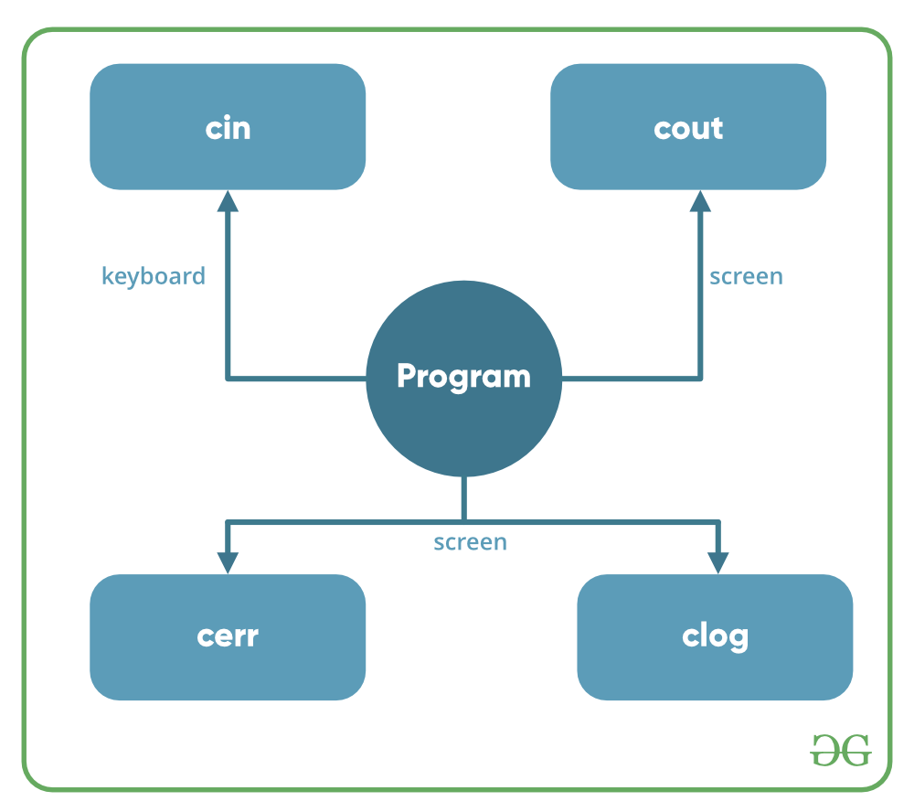
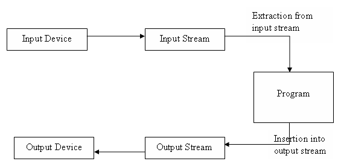
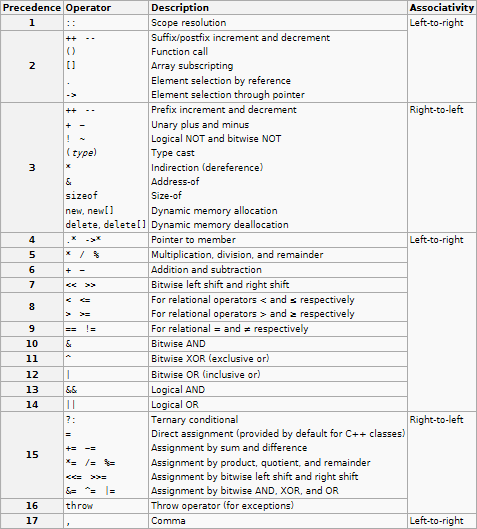

# Увод. Примитивни типове данни. Преобразуване между типове. Оператори.
## Термини

- Програма - редица от инструкции, водеща до решаване на определена задача.
- Компютърна програма - представлява код или алгоритъм, който може да бъде "разбран", разчетен и изпълнен от процесора или най-общо казано от компютъра.
- Алгоритъм - поредица от инструкции/стъпки за решаване на даден проблем.
- Програмиране -  компютърна наука и дял от математиката-информатиката, която се занимава с алгоритмите, методите и средствата за създаване на компютърни програми.
- Език за програмиране - изкуствен език, предназначен за задаване на команди, които искаме компютърът да прочете, обработи и изпълни.
- Компилатор -  превежда кода от програмен език на машинен код.
- Среди за разработка/Среди за програмиране (IDE = Integrated Development Environment) - съвкупност от традиционни инструменти за разработване на софтуерни приложения.

## Стандартен вход&изход

- Input/Output in C++ - под формата на поредица от байтове или по-полулярните streams.
- Input stream - Ако посоката на потока от байтове е от устройството (например клавиатура) към главната памет, тогава този процес се нарича вход.
- Output stream - Ако посоката на потока от байтове е обратното, т.е. от главната памет към устройството (например екран), тогава този процес се нарича изход.

<div style="display: flex; justify-content: space-between;">


</div>

## Променливи 

Деклaрация на променлива:
```c++
<тип> <име> = <стойност>;
```

**Примитивни типове:**
- Целочислен тип (**int, short, long** ..).
- Числа с плаваща запетая (**double, float** ..).
- Булев тип (**bool**).
- Символен тип (**char**).
   
Същестуват и други примитивни типове, които ще се разгледат по-напред в курса.

```c++
int N = 50;          //N is an integer variable with value 50
double PI = 3.14159; //PI is a double variable with value 3.14159
bool bOk = 0;        //bOk is a boolean variable with value 0, i.e. false
char symbol = 'N';   //symbol is a char variable with value 'N'
```

**Име на променливи:**
- Могат:
  - да съдържат малки букви.
  - да съдържат главни букви.
  - да съдържат цифри.
  - да съдържат долни черти.
- **НЕ** могат:
  - да са запазени думи(int,main,return и т.н).
  - да започват с цифра.
  - да съдържат интервали.

## Преобразуване между типовете
Преобразуването може да се извърши:

- Без загуба на информация:
```c++
bool b = true;
int a = b; // 1

int n = 4; 
double m = n; //4.0 
```
- Със загуба на информация:
 ```c++
int a = 10;
bool b = a; //1 <-> true 

double PI = 3.14;
int a = PI; //3
```
 
## Oператори

#### Аритметични оператори:

| Оператор | Значение | Значение | Резултат |
| :---: | :---: | :---: | :---: |
| + | Събиране | 5 + 2 | 7 |
| - | Изваждане | 5 - 2 | 3 |
| * | Умножение | 5 * 2 | 10 |
| / | Деление | 5 / 2 | 2 |
| % | Деление с остатък | 5 % 2 | 1 |

#### Оператори за сравнение ( винаги връщат истина/лъжа(**bool**) ):

| Оператор | Значение | Значение | Резултат |
| :---: | :---: | :---: | :---: |
| < | По-малко | 1 < 2| True |
| > | По-голямо | 1 > 2 | False |
| <= | По-малко или равно | 1 <= 2 | True |
| >= | По-голямо или равно | 2 >= 2 | True |
| == | Равно на | 1 == 2| False |
| != | Не е равно на | 1 != 2 | True |

#### Логически оператори:

| Оператор | Значение | Значение | Резултат |
| :---: | :---: | :---: | :---: |
| && | Логическо **и** | (5<2) && (5>3)| False |
| ll | Логически **или** | (5<2) ll (5>3) | True |
| ! | Логическо **не** | !(5<2) | True |


#### Оператори за присвояване:
| Оператор | Пример | Eквивалентен |
| :---: | :---: | :---: |
| += | m += 10 | m = m + 10 |
| -= | m -= 10 | m = m - 10 | 
| *= | m *= 10 | m = m * 10 | 
| /= | m /= 10 | m = m / 10 |
| %= | m %= 10 | m = m % 10 |

Всеки оператор има:

- Приоритет
- Асоциативност
- Позиция на оператора спрямо аргумента - префиксен, инфиксен и суфиксен. <br />
Таблица с всички оператори в c++:

<p align="left">
  
</p>