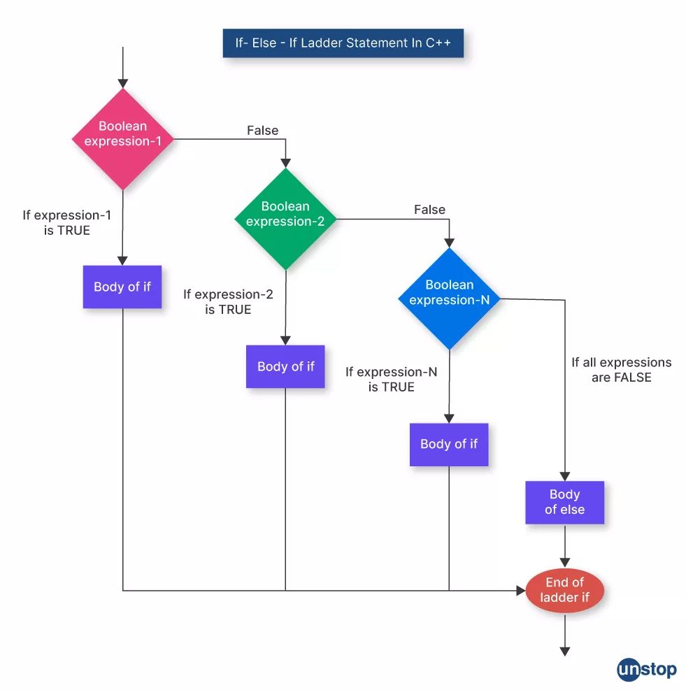
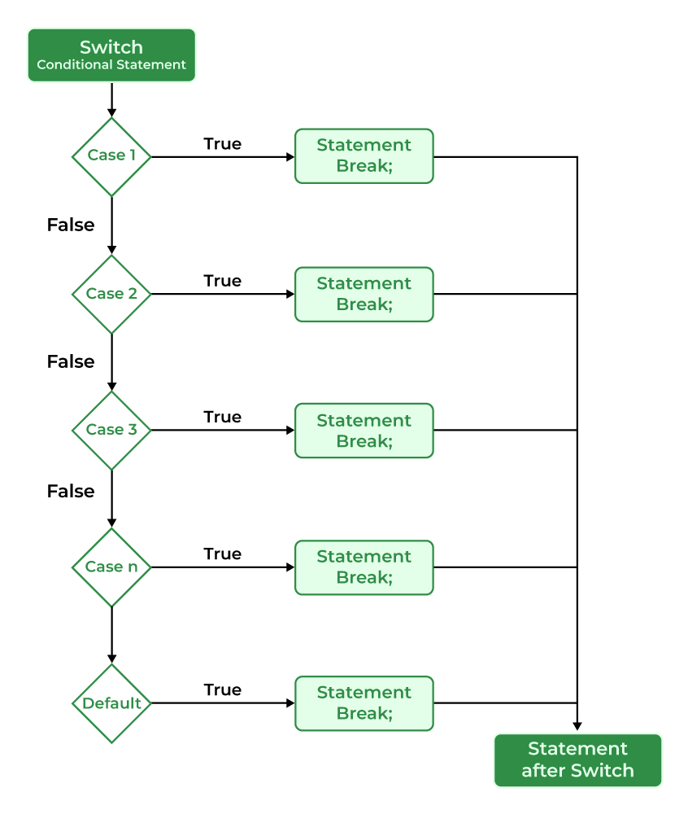
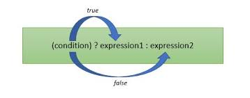

# Условни конструкции
Конструкция, която дава възможност да се изпълни (или не) една или друга последователности от действия (оператори), в зависимост от някакво условие, се нарича **условна**.

## if - else
```c++
if (<условие>)
{
  <действие>
}
```

### Семантика
- `if` (ако) – запазена дума в езика C++.
- `else` (иначе) - запазена дума в езика C++.
- `else if` (или ако) - запазена дума в езика C++.
- `<условие>` – булев израз (резултатът трябва да е `bool`).
- `<действие>` – действие или последователност от действия.

Пресмята се стойността на булевия израз, обуславящ условието.
Ако резултатът е `true`, изпълнява се `<действие>`.
В противен случай `<действие>` **НЕ** се изпълнява.

**Важно:**
- Ако `<действие>` е само един оператор, фигурните скоби `{}` **не са задължителни**, но са **силно препоръчителни** за четимост.
- Променливи, декларирани вътре в `if` блок, са видими само в този блок (scope).

```c++
if (<условие>)
{
  // изпълнява се, ако условието е истина
}
else // не е задължителен компонент
{
  // изпълнява се, ако условието е лъжа
}
```

**Пример:**
```c++
int x = 10;

if (x > 5)
{
    cout << "x е по-голямо от 5" << endl;
}
else
{
    cout << "x е по-малко или равно на 5" << endl;
}
```
### if - else if - else
```c++
if (<condition1>)
{
    // изпълнява се, ако <condition1> е истина
}
else if (<condition2>)
{
    // изпълнява се, ако <condition1> е лъжа и <condition2> е истина
}
else if (<condition3>)
{
    // изпълнява се, ако <condition1> и <condition2> са лъжа и <condition3> е истина
}
// ... може да има произволен брой else if
else if (<conditionK>)
{
    // изпълнява се, ако всички предходни условия са лъжа и <conditionK> е истина
}
else // не е задължителен компонент
{
    // изпълнява се, ако всички горни условия са лъжа
}
```

**Пример:**
```c++
int score = 85;

if (score >= 90)
{
    cout << "Отличен" << endl;
}
else if (score >= 75)
{
    cout << "Много добър" << endl;
}
else if (score >= 60)
{
    cout << "Добър" << endl;
}
else if (score >= 50)
{
    cout << "Среден" << endl;
}
else
{
    cout << "Слаб" << endl;
}
// Изход: Много добър
```

> **Важно:** Условията се проверяват последователно отгоре надолу. Щом едно условие е изпълнено, останалите **НЕ** се проверяват.

<p align="left">
  
</p>

## Switch statement

```c++
switch(<израз>)
{
  case <стойност1> : <действия>;
  break;
  case <стойност2> : <действия>
  break;
  case <стойностN> : <действия>;
  break;
  default: <действия>;
}
```

### Семантика
- `switch` (ключ) - запазена дума.
- `case` (случай, вариант) - запазена дума.
- `<израз>` – израз от допустим тип (`int`, `char`, `bool`, изброим тип `enum`).
  - Реалните типове `double` и `float` **НЕ** са допустими.
- `<стойност1>`, `<стойност2>`, ... `<стойностN>` – **константни** изрази с различни стойности, съвместими с типа на `<израз>`.
- `default` (по подразбиране) – незадължителен; изпълнява се, ако нито един `case` не съвпада.
- `break` – прекратява изпълнението на `switch` и излиза от него.

**Важно за break:**
- Ако липсва `break`, изпълнението продължава в следващите `case` блокове (т.нар. **fall-through**).
- `fall-through` може да се използва умишлено, но трябва да е ясно документирано.

```c++
switch (<израз>)
{
    case value1:
        // код за value1
        break;
    
    case value2:
        // код за value2
        break;
    
    case value3:
        // код за value3
        break;
    
    default:
        // код, ако няма съвпадение
        break; // break в default е опционален, но добра практика
}
```

**Пример:**
```c++
int day = 3;

switch (day)
{
    case 1:
        cout << "Понеделник" << endl;
        break;
    
    case 2:
        cout << "Вторник" << endl;
        break;
    
    case 3:
        cout << "Сряда" << endl;
        break;
    
    case 4:
        cout << "Четвъртък" << endl;
        break;
    
    case 5:
        cout << "Петък" << endl;
        break;
    
    case 6:
    case 7:
        cout << "Уикенд" << endl; // fall-through за case 6 и 7
        break;
    
    default:
        cout << "Невалиден ден" << endl;
        break;
}
// Изход: Сряда
```

<p align="left">
  
</p>

## Тернарен оператор

Тернарният оператор е съкратена форма на `if-else` конструкция, която връща стойност.

### Синтаксис
```c++
<условие> ? <израз1> : <израз2>
```

### Семантика
- Ако `<условие>` е истина (`true`), се връща стойността на `<израз1>`.
- Ако `<условие>` е лъжа (`false`), се връща стойността на `<израз2>`.

<div style="text-align: left;">

</div>

**Примери:**
```c++
// Намиране на по-голямото от две числа
int a = 10, b = 20;
int max = (a > b) ? a : b; // max = 20

// Проверка за четност
int num = 7;
string result = (num % 2 == 0) ? "четно" : "нечетно"; // result = "нечетно"

// Използване в cout
int age = 16;
cout << "Вие сте " << ((age >= 18) ? "пълнолетен" : "непълнолетен") << endl;

// Вложени тернарни оператори (НЕ е препоръчително за четимост)
int x = 5;
string type = (x > 0) ? "положително" : (x < 0) ? "отрицателно" : "нула";
```

**Важно:**
- Използвайте тернарен оператор за **прости** условия.
- За сложна логика предпочитайте `if-else` за по-добра четимост.
- И двата израза (`<израз1>` и `<израз2>`) трябва да са от съвместими типове.

## Задачи

1. **Between 100 and 200** <br />
   Да се напише програма, която въвежда цяло число и проверява дали е под 100, между 100 и 200 или над 200. <br />
   Да се отпечатат съответно съобщения като в примерите по-долу: <br />
        
    **Примери:** <br />
      - Вход: 95, Изход: Less than 100 <br />
      - Вход: 120, Изход: Between 100 and 200 <br />
      - Вход: 250, Изход: Greater than 200 <br />

2. **Speed check** <br />
   Да се напише програма, която въвежда скорост (десетично число) и отпечатва информация за скоростта. <br />
    - При скорост до 10 (включително) отпечатайте “slow”.
    - При скорост над 10 и до 50 отпечатайте “average”.
    - При скорост над 50 и до 150 отпечатайте “fast”.
    - При скорост над 150 и до 1000 отпечатайте “ultra fast”.
    - При по-висока скорост отпечатайте “extremely fast” <br />
      
    **Примери:** <br />
     - Вход: 8, Изход: slow <br />
     - Вход: 49.5, Изход: average <br />
     - Вход: 126, Изход: fast <br />
     - Вход: 3500, Изход: extremely fast <br />
  
3. **Chainsaw** <br />
   Ще казваме, че поредица от числа е трион, ако всяко число в нея е едновременно по-голямо или равно от двата си съседа или пък едновременно по-малко или равно от тях. За първия и последния елемент имаме само по един съсед. <br />
   Напишете програма, която въвежда от стандартния вход 5 на брой цели числа. <br />
   Да се изведе на стандартния изход "yes", ако въведената поредица е трион, или "no", в противен случай. <br />

     **Примери:** <br />
      - Вход: 1 5 1 0 3 , Изход: no <br />
      - Вход: -10 10 -2 11 -22 , Изход: yes <br />
