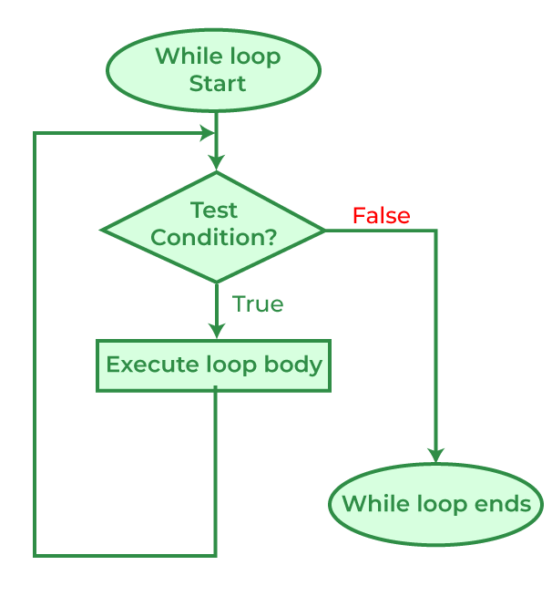
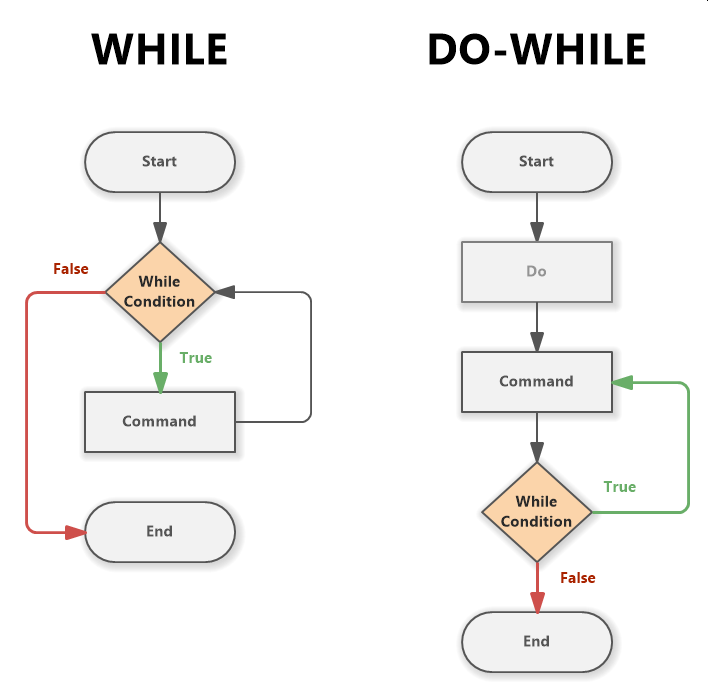

# Цикли. Оператори break и continue.

## Въведение

- Дефиниция:
    - Процес, който представлява многократното изпълнение на дадена последователност от операции с еднакви/различни данни.
    - Неформална дефиниция: Цикъл е операция, която се повтаря N на брой пъти.
- Видове цикли според броя повторения:
    - Индуктивен (итеративен с известен брой повторения)
        - цикъл, при който броят на повторенията е предварително известен.
    - Итеративен (с неизвестен брой повторения)
        - цикъл, при който броят на повторенията НЕ е известен предварително и зависи от условие.
- Основни елементи на цикъл:
    - Инициализация - задаване на начални стойности.
    - Условие - проверка, която определя дали цикълът ще продължи.
    - Тяло- кодът, който се изпълнява при всяка итерация.
    - Корекция/актуализация - промяна на променливи, за да се приближим към края на цикъла.

## Цикъл while

```c++
while(<условие>)
{
	 <действия>
}
```

### Семантика
- `while` (докато) – запазена дума.
- `<условие>` - булев израз, който се проверява **преди** всяка итерация.
- `<действия>` – кодът в тялото на цикъла, който се изпълнява при всяка итерация.

### Работа на цикъла
- Пресмята се стойността на `<условие>`.
- Ако е `false`, изпълнението на цикъла завършва (тялото може да не се изпълни нито веднъж).
- Ако е `true`, изпълнява се `<действия>` и се връщаме на стъпка 1.
- Процесът продължава, докато `<условие>` не стане `false`.

> **Важно:** При `while` цикъл условието се проверява **преди** изпълнението на тялото, затова тялото може да не се изпълни нито веднъж.



```c++
//Пример
while (true)
{
    std::cout << "I love C++\n"; //безкраен цикъл
}

//Пример
unsigned i = 0;
while(i < 1000) {
    std::cout << i; //ще изпише числата от 0 до 999
    ++i;
}
```

## Цикъл do-while
```c++
do
{
  <действия>
} while(<условие>);
```

### Семантика
- `do` (направи/прави), `while` (докато) – запазени думи.
- `<действия>` - кодът в тялото на цикъла, който се изпълнява при всяка итерация.
- `<условие>` - булев израз, който се проверява **след** всяка итерация.

### Работа на цикъла
- Изпълнява се `<действия>` (тялото на цикъла).
- Пресмята се стойността на `<условие>`.
- Ако е `true`, се връщаме на стъпка 1.
- Ако е `false`, изпълнението на цикъла завършва.

### Ключова разлика с while
Тялото на `do-while` се изпълнява **поне веднъж**, защото условието се проверява **след** изпълнението на тялото.



```c++
// Пример: Валидация на вход (типично приложение на do-while)
int number;
do
{
    std::cout << "Enter a number between 1 and 10: ";
    std::cin >> number;
    
    if (number < 1 || number > 10) {
        std::cout << "Invalid number! Please try again." << std::endl;
    }
} while (number < 1 || number > 10);

std::cout << "You entered: " << number << std::endl;
```

> **Важно: Тялото на `do-while` цикъл се изпълнява поне веднъж, независимо от условието!**

**Кога да използваме do-while:**
- Когато искаме да изпълним операция поне веднъж преди да проверим условие.
- Типично за валидация на вход от потребителя.
- Менюта, които трябва да се покажат поне веднъж.


### Цикъл for
```c++
for ( <инициализация>; <условие> ; <корекция> )
{
    <действия> //Тяло на цикъла
}
```

### Семантика
- `for` - запазена дума.
- `<инициализация>` - задава начална стойност на променливи; изпълнява се **само веднъж** в началото.
- `<условие>` - булев израз, който се проверява **преди всяка итерация**.
- `<корекция>` - израз, който се изпълнява **след всяка итерация** (обикновено увеличава/намалява брояч).

### Работа на цикъла
- Изпълнява се `<инициализация>` (само веднъж).
- Проверява се `<условие>`:
   - Ако е `false`, цикълът завършва.
   - Ако е `true`, продължаваме на стъпка 3.
- Изпълнява се тялото на цикъла (`<действия>`).
- Изпълнява се `<корекция>`.
- Връщаме се на стъпка 2.

### Важни детайли
- Променливата, декларирана в `<инициализация>`, е видима **само** в тялото на `for` цикъла (scope).
- Всяка от трите части (`<инициализация>`, `<условие>`, `<корекция>`) може да бъде празна, но `;` са задължителни.
- `for (;;)` създава безкраен цикъл (еквивалентно на `while (true)`).

### Предимства на for цикъл
- Компактен синтаксис - всичко е на едно място.
- Подходящ за цикли с известен брой итерации.
- Ясно видим брояч и неговата промяна.

```c++
// Пример: Основен for цикъл
for (int i = 0; i < 10; i++)
{
    std::cout << i << " "; // 0 1 2 3 4 5 6 7 8 9
}

// Пример: Вложени for цикли (таблица за умножение)
for (int i = 1; i <= 5; i++)
{
    for (int j = 1; j <= 5; j++)
    {
        std::cout << i * j << "\t";
    }
    std::cout << std::endl;
}
```

### Корекция - Prefix or postfix (++i vs i++)
- Във `for` цикли обикновено няма разлика в резултата.
- `++i` (prefix) е леко по-ефективен за сложни типове.
- За `int` компилаторът оптимизира и двете.
- **Препоръка:** Използвайте `++i` за добра практика.
    


## Оператор break

- Описание:
    - `break` се използва за **преждевременно излизане** от цикъл, преди той да е завършил изпълнението си по естествения си начин.
- Действие:
    - Когато се изпълни `break` в цикъл, **незабавно** се излиза от цикъла.
    - Изпълнението продължава с първия оператор **след** цикъла.
    - При вложени цикли `break` излиза само от **най-вътрешния** цикъл.
- Приложение:
    - Излизане при изпълнение на специфично условие.
    - Прекъсване на търсене след намиране на резултат.
    - Изход от безкрайни цикли с конкретно условие.

```c++
int number;

while (true) {
    cout << "Enter a number (0 to stop): ";
    cin >> number;

    if (number == 0) {
        break;   // прекратява цикъла при специално условие
    }

    cout << "You entered: " << number << endl;
}

cout << "Program finished." << endl;
```

## Оператор continue
- Описание:
    - `continue` се използва, когато искаме да **пропуснем** остатъка от текущата итерация и да преминем директно към **следващата итерация**.
- Действие:
    - Пропуска всички оператори **след** `continue` в текущата итерация.
    - Преминава директно към проверката на условието (в `while` и `do-while`) или към корекцията (в `for`).
    - **НЕ прекъсва** цикъла - само прескача до следващата итерация.

```c++
// Пример: Отпечатване на всички четни числа от 1 до 20
for (int i = 1; i <= 20; i++) {
    if (i % 2 != 0) {
        continue; // Пропускаме нечетните числа
    }
    std::cout << i << " "; // Изпълнява се само за четни числа
}
```

### Разлика между break и continue:
- `break` - **излиза** от цикъла напълно.
- `continue` - **пропуска** само остатъка от текущата итерация и продължава със следващата.

## Задачи

1. Да се напише програма, която приема поток от числа. Числата се събират, докато не срещне числото 0. <br />
   Тогава трябва да се отпечата акумулираният резултат и програмата да приключи. <br />

   Вход: 1 2 3 4 5 6 0 | Изход: 21 <br />
   Вход: 9 9 1 0       | Изход: 19 <br />
   Вход: 5 4 3 0       | Изход: 12 <br />
   
2. Да се напише програма, която приема цяло положително число, обръща го и го увеличава с 1. <br />
   
   Вход: 123   | Изход: 322 <br />
   Вход: 24689 | Изход:98643 <br />
   
3. Да се напише програма, която приема 2 числа. Да се отпечатат всички общи делители сортиран наобратно. <br />
   
   Вход: 28 21 | Изход: 7 1 <br />
   Вход: 60 30 | Изход: 30 15 10 6 5 3 2 1 <br />
