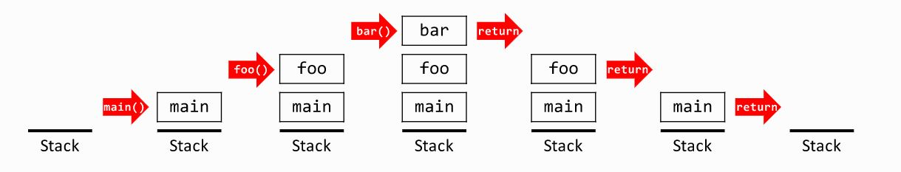

# Функции

## Дефиниция

В контекста на програмирането, функция е именувана група от инструкции, които изпълняват конкретна функционалност.

### Предимства на функциите:
- Модулност - разделяне на кода на логически части
- Преизползваемост - функциите могат да се извикват многократно
- Четимост - кодът е по-ясен и структуриран
- Лесна поддръжка - промените се правят на едно място
- Абстракция - скриване на детайли на имплементацията

## Синтаксис

```c++
<тип_резултат> <идентификатор>(<параметър1>, <параметър2>, ...)
{
    <тяло на функцията>
}
```

### Компоненти на функцията:

- `<тип_резултат>` – типът на стойността, която функцията връща, или `void`, ако не връща резултат
- `<идентификатор>` – име на функцията (трябва да е описателно)
- `<параметър>` – всеки параметър се състои от `<тип>` и `<идентификатор>`
- `<тяло>` – блок от код, който се изпълнява при извикване на функцията

> Сигнатура на функция: комбинацията от име и типове на параметрите (без връщания тип).

### Семантични бележки
- `void` - специален тип, означаващ "няма връщана стойност"
- Функция с тип различен от `void` **трябва** да върне стойност чрез `return`, иначе - грешка при компилация
- При подаване на **примитивен тип** или обект като параметър, се създава **копие** в scope-а на функцията (pass by value)
- Извикването на функция е операция с **много висок приоритет**
- Функциите трябва да бъдат **декларирани или дефинирани преди** да бъдат използвани
- Параметрите на функцията са **локални променливи** с scope само вътре във функцията

### Пример
```c++
#include <iostream>

// Функция без параметри и без връщана стойност
void helloWorld()
{
    std::cout << "Hello World!" << std::endl;
}

// Функция с параметри и връщана стойност
int add(int a, int b)
{
    return a + b;
}

// Функция с параметри без връщана стойност
void printNumber(int num)
{
    std::cout << "Number: " << num << std::endl;
}

int main()
{
    helloWorld();              // Извикване на функция без параметри
    
    int sum = add(5, 3);       // Извикване с параметри и запазване на резултата
    std::cout << "Sum: " << sum << std::endl; // Изход: Sum: 8
    
    printNumber(42);           // Извикване с параметър
    
    return 0;
}
```

### Оператор return

Функции на `return`:
- Прекратява незабавно изпълнението на функцията.
- Връща стойност на извикващата функция (ако типът не е `void`).
- Може да има **множество `return` изрази** в една функция.

**При void функции:**
```c++
void printPositive(int num)
{
    if (num <= 0) {
        return; // Ранно приключване, не се изпълнява кода след това
    }
    std::cout << "Positive number: " << num << std::endl;
}
```

**При функции с връщана стойност:**
```c++
int max(int n, int k)
{
    return n > k ? n : k; // Връща по-голямото от двете числа
}

int absolute(int num)
{
    if (num < 0) {
        return -num; // Множество return изрази
    }
    return num;
}

// ЛОШО - код след return никога не се изпълнява!
int bad()
{
    return 5;
    std::cout << "Never printed"; // Unreachable code - предупреждение
}
```

**Важно:**
- Всички пътища на изпълнение в non-void функция **трябва** да завършват с `return`
- Код след `return` **не се изпълнява** (unreachable code)
- `return` без стойност е валиден само за `void` функции

## Параметри по копие (Pass by value)

**По подразбиране, C++ подава аргументи към функции чрез копиране.**

```c++
#include <iostream>

void increment(int n)
{
    n++;                        // Променя се САМО локалното копие
    std::cout << "Inside function: " << n << std::endl; // 5
}

int main()
{
    int n = 4;
    std::cout << "Before: " << n << std::endl; // 4
    
    increment(n);               // Подава се копие на n
    
    std::cout << "After: " << n << std::endl;  // 4 - оригиналът е непроменен!
    
    return 0;
}
```

### Как работи pass by value
- При извикване на функцията се създава копие на аргумента.
- Функцията работи само с копието.
- Промените във функцията НЕ засягат оригиналната променлива.
- След приключване на функцията, копието се унищожава.

## Параметри по референция (Pass by reference)

**Референцията е алтернативно име (псевдоним) на съществуваща променлива.**

Обявява се чрез символа **`&`** след типа на параметъра.

```c++
#include <iostream>

void increment(int &n)          // & означава референция
{
    n++;                        // Променя ДИРЕКТНО оригиналната променлива
    std::cout << "Inside function: " << n << std::endl; // 5
}

int main()
{
    int n = 4;
    std::cout << "Before: " << n << std::endl; // 4
    
    increment(n);               // Подава се референция (не копие!)
    
    std::cout << "After: " << n << std::endl;  // 5 - оригиналът Е ПРОМЕНЕН!
    
    return 0;
}
```

**Класически пример - swap функция:**
```c++
void swap(double &a, double &b)
{
    double temp = a;
    a = b;
    b = temp;
}

int main()
{
    double x = 3.5, y = 7.2;
    std::cout << "Before: x=" << x << ", y=" << y << std::endl; // x=3.5, y=7.2
    
    swap(x, y);
    
    std::cout << "After: x=" << x << ", y=" << y << std::endl;  // x=7.2, y=3.5
    
    return 0;
}
```

### Как работи pass by reference
- При извикване **НЕ се създава копие**.
- Функцията получава **директен достъп** до оригиналната променлива.
- Промените във функцията **ЗАСЯГАТ** оригиналната променлива.
- По-ефективно за големи обекти.

### Кога да използваме
- Когато искаме функцията да **модифицира** оригиналната променлива.
- Когато подаваме **големи обекти** и искаме да избегнем копиране.
- Когато функцията трябва да върне **множество стойности** чрез параметрите.

## Function Overloading (Претоварване на функции)

**Overloading** позволява на няколко функции да имат **едно и също име**, но **различни параметри** (брой или тип).

### Как работи 
- Компилаторът избира **правилната версия** на базата на подадените аргументи.
- Може автоматично да прави **type conversion** при нужда.
- Ако **не намери** подходяща версия - **грешка при компилация**.
- Ако намери **повече от 1** подходяща версия - **грешка за ambiguity (двусмислие)**.

### Основни правила
- Функциите трябва да се различават по **брой** и/или **тип** на параметрите
- **Само връщаният тип НЕ е достатъчен** за разграничаване
- Подредбата на параметрите **има значение**
- `const` и non-const параметри **могат** да създадат двусмислие за примитивни типове

**Примери:**

```c++
void cout(char a) { std::cout << a; } //1

void cout(int a) { std::cout << a; } //2

void cout(char a, int b) { std::cout << a << '-' << b; } //3

void cout(double a, char b) { std::cout << b << '-' << a; } //4

void cout(bool a) { std::cout << a; } //5

void cout(char a, bool b, int c) { std::cout << a <<b << c; } //6

void cout(const int a) { std::cout << a; } //7

void cout(char a, unsigned b) { std::cout << a << '-' <<b; } //8

char cout(char a) { return a; } //9
```

```c++
void cout(char a) { std::cout << a; } //двусмислие с 9

void cout(int a) { std::cout << a; } // двусмислие със 7

void cout(char a, int b) { std::cout << a << '-' << b; } //двусмислие с 8

/*-------------------------------------------------------*/
void cout(double a, char b) { std::cout << b << '-' << a; }

void cout(bool a) { std::cout << a; }

void cout(char a, bool b, int c) { std::cout << a << b << c; }
/*-------------------------------------------------------*/

void cout(const int a) { std::cout << a; } // двусмислие с 2

void cout(char a, unsigned b) { std::cout << a << '-' << b; } // двусмислие с 3

char cout(char a) { return a; } // двусмислие с 1
```

**Важно:**
- Подредбата на параметрите **има значение** - `func(int, double)` и `func(double, int)` са **различни** функции
- Overloading прави кода **по-четим** и **по-лесен за използване**
- **Избягвайте** прекалено много overloads - усложнява кода

## Параметри по подразбиране
Възможно е да имате програма, в която 90% от случаите подавате eдин и същ параметър на дадено място. <br />
C++ позволява да имате стойност по подразбиране за 1 или повече параметри, които не се налага да уточнявате при извикване на функцията. <br />

```c++
#include <iostream>

void print(int a, int b = 5)
{
    std::cout << a << " " << b;
}

int main()
{
    print(4); // 4 5
    print(3, 6); // 3 6
    
    return 0;
}
```

> **Важно:** Параметрите по подразбиране трябва винаги да са в края!
```c++
#include <iostream>

void print(int a, int b = 5, char c = 't') {
    std::cout << a << " " << b << " " << c;
}

int main() {
    print(4); // 4 5 t
    print(3,6); // 3 6 t
    print(3, '0'); // 3 48 t
    
    return 0;
}

//‘0’ има стойност 48 в ASCII => компилаторът го разглежда като int със стойност 48
```

> **Важно:** Параметрите по подразбиране винаги са в последователността, в която са дефинирани, не могат да се прескачат

## Function Declaration vs Definition
Declaration – казва на компилатора, че така функция съществува. <br />
Definition – казва на компилатора, какво всъщност прави тази функция(нейната функционалност). <br />
Една функция **може да бъде декларирана**, но да **не бъде дефинирана**. Получаваме компилационна грешка, ако тази функция бъде извикана. <br />

```c++
#include <iostream>

//Declaration
void helloWorld(); 

int main()  {
    helloWorld();
    
    return 0;
}

//Definition
void helloWorld() {
    std::cout << "Hello World!\n";
}
```

## Стек и Стекова рамка

> Тази тема е въведение и ще бъде разгледана по-подробно по-късно, когато обсъждаме управлението на паметта.

Засега е важно да знаем, че съществува стекова памет (stack), която се използва за:
- извикванията на функции;
- техните параметри;
- локалните променливи;
- връщането на управлението след приключване на функция.

### Стекова памет (Stack)
Стековата памет работи по принципа LIFO (Last In, First Out) – последното добавено нещо се премахва първо. Това означава, че:
- последно извиканата функция се изпълнява първа;
- когато функция приключи, нейната памет се освобождава автоматично.

### Стекова рамка (Stack Frame)
При всяко извикване на функция се създава стекова рамка – логическа област в стека, която съдържа:
- стойностите на параметрите на функцията;
- адреса, към който програмата трябва да се върне след return (return address);
- информация за предишната стекова рамка;
- всички локални променливи, декларирани във функцията;
- (ако има) място за върнатата стойност.

Да разгледаме следния пример:
```c++
void bar() { }

void foo() {
  bar();
}

int main() {
  foo();
}
```
Кои стекови рамки се намират в стека, във всеки един момент на изпълнение на програмата, са показани на долната картинка:


## Задачи
1. Напишете функция, която приема неотрицателно число n и връща числото обърнато. <br />
Вход: 288  
Изход: 882

2. Напишете функция, която приема неотрицателно число и връща дали числото е палиндром. <br />
Вход: 2882  
Изход: true

3. Напишете функция, която приема неотрицателно число и връща дали цифрите му са сортирани (във възходящ или в низходящ ред). <br />
Вход: 122239  
Изход: true
