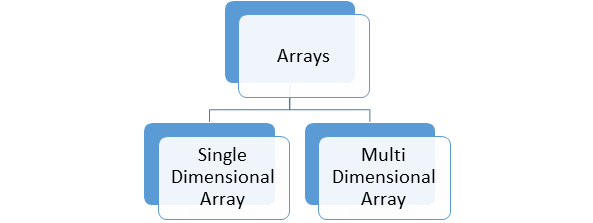

# Масиви (Arrays)

## Дефиниция

**Масив** е **наредена последователност от елементи от един и същи тип**, съхранявани в **последователни области на паметта**.

### Основни характеристики:
- Всички елементи са от **еднакъв тип**.
- Елементите са разположени **последователно в паметта**.
- **Фиксиран размер** - определя се при декларация и не може да се променя.
- **Индексация започва от 0** - първият елемент е на индекс 0.
- **Константен достъп** - достъп до всеки елемент за O(1) време.
- Името на масива е **указател към първия елемент**.

## Синтаксис

```c++
<тип> <име>[<размер>];
```

### Компоненти
- `<тип>` - типът на елементите в масива (`int`, `double`, `char` и т.н.)
- `<име>` - идентификатор на масива (трябва да е описателен)
- `<размер>` - брой елементи (трябва да е **константа**, известна при компилация)



## Инициализация на масиви

```c++
int arr[5]; // Създава масив от 5 елемента, всеки от които е цяло число.
int arr2[] = {34, 21, 2, 66, 567}; // Създава масив от 5 елемента.
int arr3[5] = {1,2,3}; //Останалите елементи се запълват с default-на стойност. 
int arr4[]; //грешка
int arr5[4] = {1, 2, 3, 4, 5} // грешка
```

Задължително големината на масива трябва да е константа, чиято стойност е ясна преди да се компилира програмата.

```c++
int n;
cin >> n;
int arr[n]; //грешка!
```

```c++
const int SIZE = 4;
int arr[SIZE]; //ok!
```


## Достъп на елемент
- В масивите имаме константен достъп до всеки един елемент. <br />
- Достъпът става посредством индекси. Индексацията започва от 0. <br />
```c++
int arr[] = {1, 2, 400, 4, 5}

arr[3] = 44; //Присвоява на елементът на индекс 3 стойността 44.
             // [1, 2, 400, 44, 5]

std::cout << arr[2]; //Отпечатва на стандартния изход елементът на индекс 2 (400)
```

arr не е самият масив, а **указател към първия елемент**.
```c++
int arr[] = {1, 2, 400, 4, 5}
std::cout << arr; //ще се отпечата АДРЕСА на масива, но не и самия масив.
```
- Достъпът до елемент става, чрез смятането адреса му.
- Адресът на arr[i] е: arr + i * sizeof(type of array).
- i е брой "отмествания" надясно.

## Подаване на масиви във функции
```c++
#include <iostream>

void Print(const int arr[], int size)
{
    for (int i = 0; i < size; i++) {
        std::cout << arr[i] << " ";
    }
    std::cout << std::endl;
}

void Increment(int arr[], unsigned size) {
	for (unsigned i = 0; i < size; i++) {
		arr[i]++;
	}
}

int main() {
	const int SIZE = 4;
	int arr[SIZE]{ 1, 2, 3, 4 };

	Increment(arr, SIZE);
	Print(arr, SIZE);

	return 0;
}
```

```c++
#include <iostream>

using namespace std;

void Print(const int* arr, int size) {
	for (int i = 0; i < size; i++) {
		std::cout << arr[i] << " ";
	}
}

void Increment(int* arr, unsigned size) {
	for (unsigned i = 0; i < size; i++) {
		arr[i]++;
	}
}


int main() {
	const int SIZE = 4;
	int arr[SIZE]{ 1, 2, 3, 4 };

	Increment(arr, SIZE);
	Print(arr, SIZE);

	return 0;
}
```
Масивите се подават във функциите по адрес!  <br />
Т.е промените, които се правят върху масива във функцията, ще се отразят върху подадения като параметър масив! <br />

### Двумерни масиви.
```c++
int matrix1[3][4]; // създава се матрица с 3 реда и 4 колони

int matrix2[3][3] = { { 1, 2, 3}, { 4, 5, 6 }, {7, 8, 9} }; // изреждаме редовете

int matrix3[3][4] = { 1, 2, 3, 4, 9, 8, 7, 6, 11, 12, 13, 14 }; // изреждаме елементите

int matrix4[][4] = { 1, 2, 3, 4, 9, 8, 7, 6, 11, 12, 13, 14 }; // можем да изпуснем най-лявата спецификация на дължина

```


### Достъп до елемент.
```c++
int matrix4[][4] = { 1, 2, 3, 4, 9, 8, 7, 6, 11, 12, 13, 14 };

int* row = matrix4[1]; //ред 1 (масивът на индекс 1)

std::cout << matrix4[2][0]<< std::endl; //11

std::cout << row[2]<< std::endl; //7
```

### Примери с n-мерни масиви.

```c++
int cube[3][3][3]; // създава се тримерен масив  
```

### Достъп до елемент.

```c++
cube[2]       // двумерен масив (3x3 матрица в нашия случай);
cube[2][1]    // едномерен масив (ред с 3 елемента);
cube[2][1][0] // конкретен елемент (индекс 0 от реда);
```


## Задачи
- Отпечатване на масив. (Task 01)
- Линейно търсене в масив. (Task 02)
- Обръщане на масив. (Task 03)
- BubbleSort. (Task 04)
- Двоично търсене. (Task 05)
- [Решето на Ератостен](https://bg.wikipedia.org/wiki/Решето_на_Ератостен). (Task 06)
