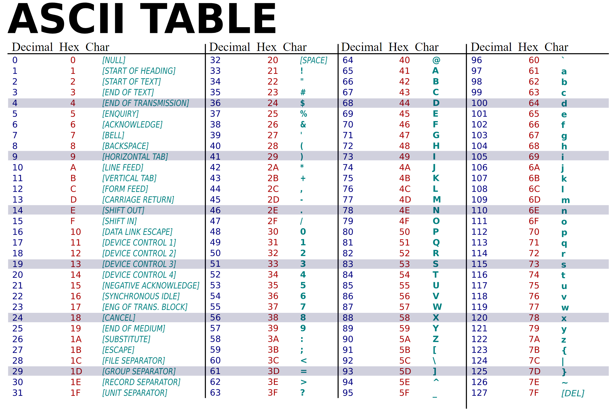

# Символен низ

## ASCII таблица - история и обяснение

### История на ASCII
- **ASCII** (American Standard Code for Information Interchange) е създаден през 1963 година.
- Разработен е от American Standards Association (сега ANSI).
- Целта е била да се създаде стандарт за представяне на текст в компютрите и телекомуникационното оборудване.
- Първоначално използва **7 бита** (128 символа), по-късно се появяват множество **8-битови** разширени кодови таблици, често наричани **Extended ASCII**, но те не са част от официалния ASCII стандарт.

### Структура на ASCII таблицата



ASCII таблицата е разделена на няколко основни групи:

#### Контролни символи (0-31)
- Специални символи за управление на текстов поток
- Примери:
  - `\0` (NULL) - код 0 - терминираща нула
  - `\n` (Line Feed) - код 10 - нов ред
  - `\t` (Tab) - код 9 - табулация
  - `\r` (Carriage Return) - код 13 - връщане в началото на реда

#### Печатни символи (32-126)
- Разликата между главна и малка буква е **32** (или 2^5)
- Цифровите символи `0`-`9` са последователни в ASCII (кодове 48-57)
- Букви:
    - Главните букви `A`-`Z` са последователни (кодове 65-90)
    - Малките букви `a`-`z` са последователни (кодове 97-122)
    - Разликата между главна и малка буква е **32** (или 2^5)
- Интервал - (код 32)
- Специални символи: `!`, `@`, `#`, `$`, `%`, `^`, `&`, `*`, и др.

#### Разширени символи (128-255)
- Extended ASCII - специфични за различни кодови страници
- Включват национални символи, математически знаци, графични елементи и др.

## Определение
- Символен низ наричаме **последователност от символи**.
- Последователност от 0 символи наричаме **празен низ**.
- Представяне в C++ - масив от символи (char), който завършва със специалния символ **'\0'**(терминираща нула).

### Важни свойства на ASCII и символни низове

```c++
char word[] = { 'H', 'e', 'l', 'l', 'o', '\0' };
char word[5] = { 'H', 'e', 'l', 'l', 'o' }; //обикновен масив от символи
char word[6] = { 'H', 'e', 'l', 'l', 'o' }; // '\0' се добавя автоматично, защото има свободен елемент
char word[100] = "Hello";
char word[5] = "Hello"; // невалидно, понеже " " включват в себе си '\0'
char word[6] = "Hello"; // валидно

// Преобразуване между символ и числов код
char letter = 'A';
int code = (int)letter;  // code = 65

char digit = '5';
int value = digit - '0'; // value = 5 (защото '5' има код 53, '0' - код 48)

// Проверка дали символ е главна буква
bool isUpperCase = (letter >= 'A' && letter <= 'Z');

// Проверка дали символ е цифра
bool isDigit = (digit >= '0' && digit <= '9');

// Преобразуване главна буква в малка
char lower = letter + ('a' - 'A');  // или letter + 32
```

### Tерминираща нула - \0
- Първият символ в ASCII таблицата, с код 0 – т.е **char(0)**.
- Брои се като елемент и **влияе** на размера на масив.
- Използва се като **прекъсвач (терминатор)** от много функции за символни низове, за да се определя края на низа.

```c++
    //Може да се сложи в средата на масив от символи
    char a []= {'H', 'e', 'l', 'l','\0', 'o'}; //символният низ е "Hell"
```

### Инициализация на символни низове

- Чрез инициализатор
```c++
//Чрез инициализатор
char text[16] = {'C','+','+', '\0'};
char sameText[] = {'C','+','+', '\0'};
```

- Чрез литерал
    - Пояснение - В информатиката под **литерал** се разбира константна стойност на променлива, зададена в сорс кода на дадена компютърна програма.
    - Tl;dr - Литерал e константна стойност, зададена директно в кода.
```c++
char sameTextAgain[] = "C++";       // автоматично добавя '\0'
char sameTextYetAgain[16] = "C++";  // останалите символи са '\0'
```

- Валидни инициализации на масив
```c++
// Инициализация с празен низ
char text[100] = "";  // Всички елементи стават '\0'

// Явна инициализация на първия елемент (C/C++ compatible)
char text[100] = {0}; // Всички елементи стават 0 (т.е. '\0')

// Brace/zero initialization (C++11 и по-нови)
char text[100] {}; // Всички елементи стават 0 (т.е. '\0')

// Занулява след деклариране
char text[100];
text[0] = '\0';  // Маркира като празен низ
```

- Неинициализиран масив
```c++
char text[100];  // Съдържа случайни стойности от паметта!

cout << text;    // Може да изпише боклук докато не срещне случайна '\0'
                 // или да продължи извън масива - undefined behavior!
```

- Инициализация с конкретен низ
    ```c++
    char text[10] = "Hello";  // Валидно
    ```
    - Първите 6 елемента съдържат 'H','e','l','l','o','\0'.
    - Останалите 4 елемента се нулират автоматично.
    ```c++
    char text[10];
    text = "Hello"
    ```
    - text не е променлива, а фиксиран блок памет, състоящ се от 10 елемента char.
    - името text е константен указател към първия елемент на масива.
    - Масивът не може да бъде преместван, променян като цял обект или „присвояван“.
    - Затова `text = "Hello";` е невалидно, защото се опитваме да "преприсвоим" адреса на масива, а text не може да промени адреса си, т.е. не може да получава нова стойност.

## Въвеждане на символни низове

### Екстракция с оператор >> (cin >>)

**Характеристики:**
- Чете **само до първия whitespace** (интервал, таб, нов ред)
- **Пропуска** водещи whitespace символи
- **Автоматично добавя** `\0` в края (когато чете в char[])
- **Не проверява** размера на масива - **опасност от buffer overflow**!

```c++
char name[10];
cout << "Enter name: ";
cin >> name;  // Ако въведем "John Doe", ще прочете само "John"
```

**Проблем с препълване на буфера:**
```c++
#include <iomanip> // setw()

char small[5];

// Опасно - Buffer overflow:
cin >> small;  // Ако въведем "HelloWorld", ще се запише извън масива!
               // Това е undefined behavior и може да сриве програмата

// Безопасен вариант:
cin >> setw(5) >> small;  // Чете до 4 символа + '\0'
```

**Защита с ограничаване на входа:**
```c++
char name[10];

cin.width(10);  // Ограничава входа до 9 символа (10-1 за '\0')
cin >> name;    // Сигурно четене (width важи само за това извличане)

// Алтернативен синтаксис:
cin >> std::setw(10) >> name;  // изисква #include <iomanip>
```

### Четене на цял ред - cin.getline()

**Характеристики:**
- Чете **цял ред включително интервали**;
- Спира при достигане на delimiter (по подразбиране `\n`);
- **Автоматично добавя** `\0` в края;
- **Премахва** delimiter символа от потока (но не го записва);
- **Има вградена защита** - параметърът за размер предпазва от overflow;

```c++
char text[100];
cin.getline(text, 100);  // Чете до 99 символа (100-1 за '\0')
```

**Синтаксис:**
```c++
// buffer    - масивът, където се записва входа
// size      - максимален брой символи за четене (включително '\0')
// delimiter - символ, при който да спре (по подразбиране '\n')
cin.getline(buffer, size, delimiter);
```

**Примери с различни delimiters:**
```c++
char data[50];
// Четене до запетая вместо до нов ред
cin.getline(data, 50, ',');

// Четене до точка
cin.getline(data, 50, '.');
```

### Проблем със смесване на >> и getline()

**Често срещан bug:**
```c++
int age;
char name[50];

cout << "Enter age: ";
cin >> age;              // Потребителят въвежда "25" и натиска Enter
                         // '\n' остава в буфера!

cout << "Enter name: ";
cin.getline(name, 50);   // Веднага чете оставащия '\n' и приключва!
                         // name остава празен!
```

**Решение:**
```c++
int age;
char name[50];

cout << "Enter age: ";
cin >> age;
cin.ignore();                    // Игнорира оставащия '\n' в буфера
// или: cin.ignore(1000, '\n');  // Изчиства всичко до нов ред

cout << "Enter name: ";
cin.getline(name, 50);   // Сега работи правилно!
```

**Helper функция за изчистване на буфера:**
```c++
void clearInputBuffer() {
    std::cin.clear();              // изчиства error flags
    std::cin.ignore(10000, '\n');  // премахва остатъка от входния поток
}

#include <limits>
// Забележка: числото 10000 от горния пример е условно „голямо“ и обикновено напълно покрива дължината на реда при учебни примери.
// За професионален код може да се използва std::numeric_limits<std::streamsize>::max() вместо 10000 за абсолютна сигурност: 
void clearInputBuffer() {
    std::cin.clear();
    std::cin.ignore(std::numeric_limits<std::streamsize>::max(), '\n');
}
```

### Пример: Сигурно четене с валидация

```c++
#include <iostream>
#include <limits>
using namespace std;

const int MAX_SIZE = 100;
char input[MAX_SIZE] = "";  // Инициализираме с празен низ

cout << "Enter text: ";
cin.getline(input, MAX_SIZE);

// Проверка дали входът е успешен
if (cin.fail()) {
    cout << "Input too long or error occurred!" << endl;
    cin.clear();  // Изчиства error флаговете
    cin.ignore(numeric_limits<streamsize>::max(), '\n');  // Изчиства целия остатък от буфера
} else {
    cout << "You entered: " << input << endl;
}
```

### Пример: Обхождане на символен низ
- Пример с масив:
```c++
for (int i = 0; text[i] != '\0'; i++) {
    std::cout << text[i];
}
```
- Пример с указател:
```c++
char* p = text;
while (*p != '\0') {
    std::cout << *p;
    p++;
}
```

## Разлика между C-style string и std::string

### C-style strings (char[])
- Ниско ниво - директна работа с паметта
- Ръчно управление на памет - програмистът е отговорен за размера и алокацията
- Терминираща нула - задължително използване на '\0' за маркиране края на низа
- Фиксиран размер - размерът се определя при декларация и не може да се променя
- Липса на вградени функции - нужни са външни функции (strlen, strcpy, strcmp и др.)
- По-бърз достъп - директен достъп до паметта без допълнителни абстракции
- Подходящ за обучение - помага да се разбере как работят низовете на ниско ниво

```c++
char str1[50] = "Hello";
char str2[50];
strcpy(str2, str1);  // трябва да използваме функция за копиране
```

### std::string
- Високо ниво - абстракция над C-style strings
- Автоматично управление на памет - динамично преоразмеряване при нужда
- Не изисква ръчно управление на `\0` — тя се управлява автоматично от класа.
    - `std::string` вътрешно има `\0`
    - `c_str()` гарантира null-terminated низ
    - ще се разгледа подробно в ООП курса.
- Динамичен размер - може да расте и намалява според нуждите
- Богат набор от методи - `length()`, `substr()`, `find()`, `append()`, `operator+` и др.
- По-безопасен - предпазва от buffer overflow и други грешки
- Част от STL - интегриран с останалите контейнери и алгоритми

```c++
#include <string>

std::string str1 = "Hello";
std::string str2 = str1;  // лесно копиране
str1 += " World";         // лесна конкатенация
```

### Кога да използваме кое?
- C-style strings: системно програмиране, legacy код, работа с C библиотеки, образователни цели
- `std::string`: модерен C++ код, когато се нуждаем от динамични операции, за по-безопасен и четим код

Пояснение: В курса по Увод в програмирането, няма да може да използваме `std::string`, освен ако експлицитно не е позволено.

## Задачи:
1. Напишете имплементация на **strlen** - *връща колко символа има от началото до ‘\0’*

2. Напишете имплементация на **strcmp** - *сравнява 2 символни низа (> , = , <)*

3. Напишете имплементация на **strcat** - *конкатенация*

4. Напишете имплементация на **strcpy** - *копира source в destination*

5. Напишете имплементация на **аtoi** - *преобразуване на стринг в число*

6. Напишете имплементация на **searchInText** - *търсене в текст*.

7. Напишете импелментация на **getCharoOccurrencesCount** - *брой срещания на кнокретен символ в текст*.