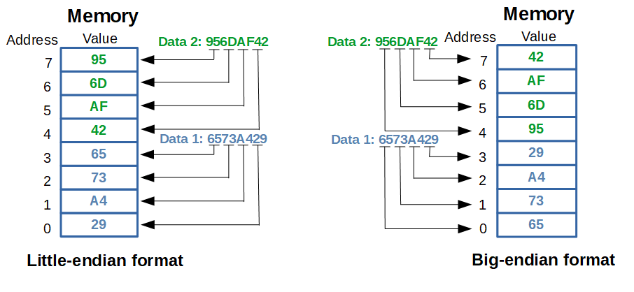

# Бройни системи (Numeral Systems)

## Дефиниция

**Бройна система** е начин за представяне на числата посредством **дадена азбука от символи**. Всяка бройна система има **основа** (base/radix), която определя броя на различните цифри, които се използват.

## Основни бройни системи в програмирането

| Бройна система | Английско име | Основа (Base) | Азбука | Префикс в C++ |
|:---:|:---:|:---:|:---:|:---:|
| **Двоична** | Binary | 2 | 0, 1 | `0b` (C++14) |
| **Осмична** | Octal | 8 | 0-7 | `0` |
| **Десетична** | Decimal | 10 | 0-9 | няма |
| **Шестнайсетична** | Hexadecimal | 16 | 0-9, A-F | `0x` |

## Таблица за преобразуване (0-20)

| Десетична | Двоична | Осмична | Шестнайсетична |
|:---:|:---:|:---:|:---:|
| 0 | 0000 | 0 | 0 |
| 1 | 0001 | 1 | 1 |
| 2 | 0010 | 2 | 2 |
| 3 | 0011 | 3 | 3 |
| 4 | 0100 | 4 | 4 |
| 5 | 0101 | 5 | 5 |
| 6 | 0110 | 6 | 6 |
| 7 | 0111 | 7 | 7 |
| 8 | 1000 | 10 | 8 |
| 9 | 1001 | 11 | 9 |
| 10 | 1010 | 12 | A |
| 11 | 1011 | 13 | B |
| 12 | 1100 | 14 | C |
| 13 | 1101 | 15 | D |
| 14 | 1110 | 16 | E |
| 15 | 1111 | 17 | F |
| 16 | 10000 | 20 | 10 |
| 17 | 10001 | 21 | 11 |
| 18 | 10010 | 22 | 12 |
| 19 | 10011 | 23 | 13 |
| 20 | 10100 | 24 | 14 |

### Важни забележки:
- В **шестнайсетична** система: A=10, B=11, C=12, D=13, E=14, F=15.
- В **двоична** система всяка позиция представлява степен на 2.
- В **осмична** система всяка позиция представлява степен на 8.
- В **шестнайсетична** всяка позиция представлява степен на 16.

## Представяне на отрицателни числа

### Sign-and-Magnitude (Знак и величина)

**Най-старият бит** указва знака (0 = положително, 1 = отрицателно).

```c++
// За 8-битово число:
 5₁₀ = 0000 0101
-5₁₀ = 1000 0101

// Проблеми:
// - Две представяния на нула: +0 (0000 0000) и -0 (1000 0000)
// - Усложнява аритметичните операции
```

### One's Complement (Допълнение до едно)

**Метод:** Обръщаме (flip) всички битове.

```c++
// За 8-битово число:
 5₁₀ = 0000 0101
-5₁₀ = 1111 1010  // Обърнати битове

// Получаване на отрицателно число:
// Обръщаме всички битове: 0→1, 1→0

// Проблеми:
// - Отново две представяния на нула
// - По-рядко използван днес
```

### Two's Complement (Допълнение до две)

**Метод:** Обръщаме всички битове + добавяме 1.

```c++
// За 8-битово число:
 5₁₀ = 0000 0101

// Стъпка 1: Обръщаме битовете
       1111 1010

// Стъпка 2: Добавяме 1
       1111 1010
     +         1
     -----------
-5₁₀ = 1111 1011

// Проверка: -5 + 5 = 0
  1111 1011  (-5)
+ 0000 0101  (+5)
-----------
1 0000 0000  (Carry bit се игнорира → 0)
```

> **Това е стандартният начин в съвременните компютри!**

### Предимства на Two's Complement:
- Едно-единствено представяне на нула
- Събирането/изваждането работи еднакво за положителни и отрицателни
- По-проста хардуерна имплементация
- Диапазон: от -2^(n-1) до 2^(n-1) - 1

# Побитови операции (Bitwise Operations)

## Дефиниция

**Побитовите операции** се прилагат върху **отделни битове** на двоични числа. Те са **много бързи** и често се използват за оптимизация, манипулация на флагове и нискониво програмиране.

## Списък на операторите

| Оператор | Име | Описание | Приоритет |
|:---:|:---:|:---|:---:|
| `~` | NOT | Побитово НЕ (обръща битовете) | Висок |
| `<<` | Left Shift | Побитово отместване наляво | Среден |
| `>>` | Right Shift | Побитово отместване надясно | Среден |
| `&` | AND | Побитово И | Нисък |
| `^` | XOR | Побитово ИЗКЛЮЧВАЩО ИЛИ | Нисък |
| `\|` | OR | Побитово ИЛИ | Най-нисък |

> **Важно:** Не бъркайте побитовите оператори (`&`, `|`) с логическите (`&&`, `||`)!

## Таблица на истинност и примери

### Побитови логически операции

| a | b | a & b | a \| b | a ^ b | ~a |
|:---:|:---:|:---:|:---:|:---:|:---:|
| 0 | 0 | 0 | 0 | 0 | 1 |
| 0 | 1 | 0 | 1 | 1 | 1 |
| 1 | 0 | 0 | 1 | 1 | 0 |
| 1 | 1 | 1 | 1 | 0 | 0 |

### Пример с 9-битови числа

```c++
int a = 0b101010100;  // 340 в десетична
int b = 0b100101110;  // 302 в десетична
```

| Операция | Двоичен резултат | Десетичен | Обяснение |
|:---:|:---:|:---:|:---|
| `a` | `101010100` | 340 | Оригинално a |
| `b` | `100101110` | 302 | Оригинално b |
| `a & b` | `100000100` | 260 | 1 само когато и двата бита са 1 |
| `a \| b` | `101111110` | 382 | 1 когато поне един бит е 1 |
| `a ^ b` | `001111010` | 122 | 1 когато битовете са различни |
| `~a` | `010101011` | 171* | Обръща всички битове |
| `~b` | `011010001` | 209* | Обръща всички битове |
| `a << 2` | `10101010000` | 1360 | Умножава по 4 (2²) |
| `a >> 2` | `001010101` | 85 | Дели на 4 (2²) |

> Забележка: За ~a и ~b показваме само 9 бита за яснота

# Endianness (Байтов ред)

## Дефиниция

**Endianness** определя **реда**, в който байтовете на многобайтово число се съхраняват в паметта.



## Видове

### Little-Endian (Малък край отпред)

**Най-малко значимият байт (LSB) се съхранява на най-ниския адрес.**

**Използва се от:**
- Intel x86/x64 (PC архитектури);
- AMD процесори;
- Повечето съвременни процесори;

**Пример:**
```c++
int value = 0x12345678;

// Адреси в паметта (Little-Endian):
Адрес  | Стойност
-------|----------
0x1000 | 0x78  ← Най-малко значим байт (LSB)
0x1001 | 0x56
0x1002 | 0x34
0x1003 | 0x12  ← Най-много значим байт (MSB)
```

**Визуализация:**
```
  Най-нисък адрес → Най-висок адрес
  [78] [56] [34] [12]
   ↑                ↑
  LSB              MSB
```

### Big-Endian (Голям край отпред)

**Най-много значимият байт (MSB) се съхранява на най-ниския адрес.**

**Използва се от:**
- Мрежови протоколи (TCP/IP) - "Network Byte Order";
- Някои RISC процесори (MIPS, SPARC, PowerPC);
- Java Virtual Machine;

**Пример:**
```c++
int value = 0x12345678;

// Адреси в паметта (Big-Endian):
Адрес  | Стойност
-------|----------
0x1000 | 0x12  ← Най-много значим байт (MSB)
0x1001 | 0x34
0x1002 | 0x56
0x1003 | 0x78  ← Най-малко значим байт (LSB)
```

**Визуализация:**
```
  Най-нисък адрес → Най-висок адрес
  [12] [34] [56] [78]
   ↑                ↑
  MSB              LSB
```

## Сравнение

| Характеристика | Little-Endian | Big-Endian |
|:---|:---:|:---:|
| Първи байт | LSB (най-малък) | MSB (най-голям) |
| Естественост | По-естествено за CPU | По-естествено за четене |
| Разпространение | По-често (Intel, AMD) | По-рядко (мрежи) |
| Предимство | По-бърза аритметика | По-интуитивно за хора |

## Практически пример

```c++
#include <iostream>

void printBytes(void* ptr, size_t size)
{
    unsigned char* bytePtr = static_cast<unsigned char*>(ptr);
    for (size_t i = 0; i < size; i++) {
        printf("%02X ", bytePtr[i]);
    }
    std::cout << std::endl;
}

int main()
{
    int value = 0x12345678;
    
    std::cout << "Value: 0x" << std::hex << value << std::endl;
    std::cout << "Bytes in memory: ";
    printBytes(&value, sizeof(value));
    
    // На Little-Endian система (Intel/AMD):
    // Изход: 78 56 34 12
    
    // На Big-Endian система:
    // Изход: 12 34 56 78
    
    return 0;
}
```

## Определяне на Endianness

```c++
bool isLittleEndian()
{
    int num = 1;
    unsigned char* ptr = reinterpret_cast<unsigned char*>(&num);
    return (*ptr == 1);  // Ако първият байт е 1 → Little-Endian
}

int main()
{
    if (isLittleEndian()) {
        std::cout << "System is Little-Endian" << std::endl;
    } else {
        std::cout << "System is Big-Endian" << std::endl;
    }
    return 0;
}
```

## Конвертиране между Endianness

```c++
// Размяна на байтовете (16-bit)
uint16_t swap16(uint16_t value)
{
    return (value >> 8) | (value << 8);
}

// Размяна на байтовете (32-bit)
uint32_t swap32(uint32_t value)
{
    return ((value >> 24) & 0x000000FF) |
           ((value >> 8)  & 0x0000FF00) |
           ((value << 8)  & 0x00FF0000) |
           ((value << 24) & 0xFF000000);
}

// По-елегантно решение за 32-bit:
uint32_t swap32_v2(uint32_t value)
{
    return ((value & 0xFF000000) >> 24) |
           ((value & 0x00FF0000) >> 8)  |
           ((value & 0x0000FF00) << 8)  |
           ((value & 0x000000FF) << 24);
}

// Стандартна библиотека (C++23):
#include <bit>
uint32_t converted = std::byteswap(value);
```

## Кога е важно Endianness?
- Мрежово програмиране
   - Изпращане/получаване на данни между различни системи
- Работа с файлове
   - Четене/писане на двоични файлове
   - Файлови формати (BMP, WAV, и др.)
- Комуникация между различни архитектури
   - Прехвърляне на данни между системи
- Ниско ниво програмиране
    - Embedded системи
    - Драйвери
    - Протоколна имплементация