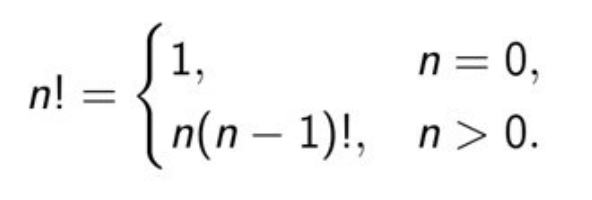

# Рекурсия

## Въведение

### Дефиниция
Рекурсия е програмна техника, при която даден метод извиква сам себе си при решаването на определен проблем. Такива методи наричаме рекурсивни.  
Един обект наричаме **рекурсивен**, ако съдържа **себе си** или е **дефиниран чрез себе си**.  
Рекурсията е програмна техника, чиято правилна употреба води до елегантни решения на определени проблеми. Понякога нейното използване може да опрости значително кода и да подобри четимостта му.


### Предназначение
Рекурсията се прави за решаване на проблеми, които могат да бъдат разделени на по-малки, повтарящи се проблеми.  
Oсобено подходящ за работа върху алгоритми, които имат много възможни разклонения и са твърде сложни за итеративен подход.

```c++
//Returns the sum of all numbers from 0 to a given integer
int sumRange(int num)
{
    if (num == 0) {
         return 0;
    }

    return num + sumRange(num - 1)
}
```


## Рекурсия и Stack паметта

За да разберем как работи рекурсията, трябва да разберем какво се случва в **Stack паметта** при всяко рекурсивно извикване.

### Stack Frame (Стекова рамка)
При всяко извикване на функция, включително рекурсивно, в Stack-а се създава нова **Stack Frame**, която съдържа:
- **Параметри на функцията** (копия на подадените аргументи)
- **Локални променливи** на функцията
- **Return address** (адрес, към който да се върне изпълнението след приключване)
- **Return value** (стойността, която функцията връща)

#### Как растат Stack Frame-овете
При рекурсивно извикване се получава **верига от Stack Frame-ове**, които се трупат един върху друг, докато не се достигне **дъното на рекурсията**.

**Пример:** Нека разгледаме `sumRange(3)`:

```
Call Stack Visualization:

Извикване 1: sumRange(3)
+-------------------+  <- Връх на Stack (най-скорошно извикване)
| sumRange(0)       |
| n = 0             |
| return 0          |  <- Дъно на рекурсията - връща резултат
+-------------------+
| sumRange(1)       |
| n = 1             |
| waiting for       |  <- Чака резултат от sumRange(0)
| sumRange(0)...    |
+-------------------+
| sumRange(2)       |
| n = 2             |
| waiting for       |  <- Чака резултат от sumRange(1)
| sumRange(1)...    |
+-------------------+
| sumRange(3)       |
| n = 3             |
| waiting for       |  <- Първото извикване - чака резултат
| sumRange(2)...    |
+-------------------+
| main()            |
+-------------------+  <- Дъно на Stack
```

**Фази на изпълнение:**
- **Фаза на нарастване (Winding)**: Stack-ът расте с всяко ново извикване.
- **Дъно**: Достига се граничното условие (`n == 0`).
- **Фаза на свиване (Unwinding)**: Stack Frame-овете се освобождават в **обратен ред**.(LIFO)

**Връзка със Sem.09 - Stack памет:**
- Stack-ът е предварително заделена памет (Windows: ~1MB, Linux: ~8MB).
- Всяка Stack Frame заема памет (зависи от параметрите и локалните променливи).
- Ако рекурсията е твърде дълбока → **Stack Overflow**.

#### Пространствена сложност (Space Complexity)
Рекурсията заема **O(n)** допълнителна памет в Stack-а, където n е дълбочината на рекурсията.

**Пример:** `sumRange(1000)` създава 1001 Stack Frame-а (от `sumRange(1000)` до `sumRange(0)`).

## Дъно на рекурсия
Реализирайки рекурсия, трябва да сме сигурни, че **след краен брой стъпки ще получим конкретен резултат**. <br />
Tрябва да имаме един или няколко случаи, чието решение можем да намерим директно, без рекурсивно извикване. Тези случаи наричаме **дъно на рекурсията**. <br />
Ако даден рекурсивен метод **няма** дъно на рекурсията, тя ще стане **безкрайна** и резултатът ще е **Stack Overflow**.

### Stack Overflow - детайлно обяснение

#### Какво е Stack Overflow?
- Възниква когато Stack паметта се изчерпа поради твърде много рекурсивни извиквания
- Програмата крашва със **Segmentation Fault** (Linux) или **Stack Overflow Exception** (Windows)
- Свързано директно с ограничения размер на Stack-а
    - Зависи от размера на Stack Frame (колко памет заема всяко извикване).

**Пример за безкрайна рекурсия:**
```c++
#include <iostream>

// Безкрайна рекурсия - НЯМА дъно!
void infiniteRecursion(int depth)
{
    std::cout << "Depth: " << depth << std::endl;
    infiniteRecursion(depth + 1);  // Никога не спира!
}

int main()
{
    infiniteRecursion(0);  // Ще крашне с Stack Overflow
    return 0;
}
```

**Изход (преди краш):**
```
Depth: 0
Depth: 1
Depth: 2
...
Depth: 7324
Segmentation fault (core dumped)
```

**Пример за твърде дълбока рекурсия:**
```c++
void stackoverflow(int random)
{
    stackoverflow(random – 1);
}

int main()
{
    int test = INT_MAX;
    stackoverflow(test);
}
```

## Създаване на рекурсивни методи
Когато създаваме рекурсивни методи, трябва да разбием задачата, която решаваме, на подзадачи, за чието решение можем да използваме същия алгоритъм (рекурсивно). <br />
Комбинирането на решенията на всички подзадачи, трябва да води до решение на изходната задача. <br />
При всяко рекурсивно извикване, проблемната област трябва да се ограничава така, че в даден момент да бъде достигнато дъното на рекурсията, т.е. разбиването на всяка от подзадачите трябва да води рано или късно до дъното на рекурсията. <br />

### Примерна програма - factorial
Ако n е произволно естествено число, следната дефиниция на функцията факториел е рекурсивна. <br />
Условието при n = 0 **НЕ** съдържа обръщение към функцията факториел и се нарича **гранично**. <br />



```c++
// В тази програма е описана рекурсивната функция fact,
// която приложена към естествено, връща факториела на това число, връща факториела на това число

int fact(const int n)
{
    if (n == 0) {
        return 1;
    }

    // Стойността на функцията се определя посредством обръщение към
    // самата функция в оператора return n * fact(n - 1);
    return n * fact(n - 1);
}

// В този случай, рекурсивното дефиниране на функцията факториел
// не е подходящо, тъй като съществува лесно итеративно решение
```


### Примерна програма - gcd
Да се напише рекурсивна функция, която намира най-големия общ делител на две естествени числа. <br />


В случая a = b играе ролята на **гранично условие**, защото не съдържа обръщение към функцията gcd(Greatest common divisor) и чрез него се достига "дъното". <br />

```c++
int gcd(const int a, const int b)
{
    if (a == b) {
        return a;
    }

    if (a > b) {
        return gcd(a – b, a);
    }

    return gcd(a, a - b);
}
```
### Примерна програма - fibonacci

Напишете програма, която въвежда цяло число n и пресмята n-тото число на Фибоначи.


```c++
int fibonacci(unsigned int n)
{
    if (n == 0) {
        return 0;  // Гранично условие 1
    }

    if (n == 1) {
        return 1;  // Гранично условие 2
    }

    return fibonacci(n - 1) + fibonacci(n - 2);
}
```

## Пряка и косвена рекурсия
Когато в тялото на метод се извършва извикване на същия метод, казваме, че методът е **пряко рекурсивен**. <br />
```c++
// An example of direct recursion
void directRecFun()
{
    // Some code....
    directRecFun();
    // Some code...
}
```

### Видове пряка рекурсия
- **Tail** - ако рекурсивното извикване е последната команда/израз.

```c++
#include <iostream>

void fun(int n)
{
    if (n > 0) {
        std::cout << n << " ";
        fun(n - 1); // Last statement in the function
    }
}
  
int main()
{
    fun(3);
    return 0;
}
```


- **Head** - ако рекурсивното извикване е първата команда/израз.

```c++
#include <iostream>

void fun(int n)
{
    if (n > 0) {
        fun(n - 1); // First statement in the function
        std::cout << " "<< n;
    }
}
  
int main()
{
    fun(3);
    return 0;
}
```


- **Linear** vs **Tree**
    - **Linear** - ако в тялото на функцията, тя се извиква само веднъж.
    - **Tree** - ако в тялото на функцията, тя се извиква повече от веднъж.

```c++
#include <iostream>
  
// Recursive function
void fun(int n)
{
    if (n > 0)  {
        std::cout << " " << n;
          
        // Calling once
        fun(n - 1);
          
        // Calling twice
        fun(n - 1);
    }
}

int main()
{
    fun(3);
    return 0;
}
```


- **Nested** - рекурсия в рекурсията. Когато се подаде рекурсия като параметър.

```c++
#include <iostream>
  
int fun(int n)
{
    if (n > 100) {
        return n - 10;
    }
  
    // A recursive function passing parameter as a recursive call
    // or recursion inside  the recursion
    return fun(fun(n + 11));
}
  
int main()
{
    std::cout << " " << fun(95);
    
    return 0;
}
```


Ако метод A се обръща към метод B, B към C, а С отново към А, казваме, че методът А, както и методите В и C са **непряко (косвено) рекурсивни** или **взаимно-рекурсивни**. <br />
Веригата от извиквания при косвената рекурсия може да съдържа множество методи, както и разклонения, т.е. при наличие на едно условие да се извиква един метод, а при различно условие да се извиква друг. <br />
```c++
// An example of indirect recursion
void indirectRecFun1()
{
    // Some code...
    indirectRecFun2();
}

void indirectRecFun2()
{
    // Some code...
    indirectRecFun3();
}

void indirectRecFun3()
{
    // Some code...
    indirectRecFun1();
}
```


## **Рекурсия vs Цикли**

### **Рекурсия:**
- Рамка в стековата памет се алокира при всяко едно извикване
на функцията.
- Получава се "верига" от много стекови рамки, докато се
достигне дъното на рекурсията.
- Рекурсията заема много памет, защото се пазят всички
стекови рамки докато не се достигне дъното.

#### **Рискове при рекурсия:**
- **StackOverFlow** - няма повече стекова памет, в която
да се заделят нови рамки (от там идва и името на
форума).
- **OutOfMemory** - няма повече Heap памет, в която да
се заделя за рекурсивните обекти, които се
инциализират вътре в рекурсивната функция.

### **Цикли:**
- Можете да използвате цикъли и без да създавате отделна
функция.
- При всяка итерация в цикъла не се създава нова рамка и не се
заема непрекъснато още памет.
#### **Рискове при циклите:**
- Може да се получи в някой частен случай безкраен
цикъл.

**Препоръка:** Ако за решаването на някаква задача е уместно да се използва итеративен алгоритъм, реализирайте го.   
**Не се препоръчва** винаги използването на рекурсия, тъй като това води до големи загуби на памет.   
