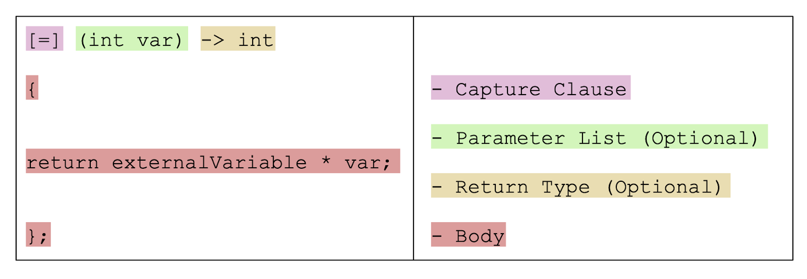

## **Указатели към функции**

Указателят към функция има за стойност адреса на изпълнимия код на дадена функция. <br />
Указателите към функции могат да се използват, за да се извикват функции и да се подават функции като параметри на други функции(функции от по-висок ред). <br />
Не може да се извършва указателна аритметика върху указатели към функции. <br />


#### **Пример чрез print function**
```c++
#include <iostream>

void HelloWorld()
{
    std::cout << "hello World\n";
}

int main()
{
    auto function = HelloWorld; //getting the function pointer/memory address of the function
                                //same as auto function = &HelloWorld

    void (*function2)() = HelloWorld;
    
    function(); //calls HelloWorld function
    function2();
}
```

**Keyword: auto** - декларира променлива, чийто тип се извежда от израза за инициализация в нейната декларация. <br />

> **Забележка:** `&HelloWorld` и `HelloWorld` са еквивалентни при работа с указатели към функции. Името на функцията автоматично се конвертира към указател към тази функция.

#### **Пример чрез функция с параметри**
```c++
#include <iostream>

int Mult(int x, int y)
{
    return x * y;
}

int main()
{
    // Declaration of function pointer
    int (*funcptr)(int, int);

    // funcptr is pointing to mult function which multiplies two numbers
    funcptr = Mult;

    // Store the result obtained
    int mul = funcptr(5, 7);

    std::cout << "The value of the product is: " << mul << std::endl;
    return 0;
}
```

## **Функции от по-висок ред/High order functions**

### **Дефиниция**
Функция от по-висок ред ще наричаме функция, която приема друга функция като аргумент или връща функция като резултат.

#### **Function Pointer as Return Type**

```c++
#include <iostream>

// define the function pointer type
typedef int (*ptr)(int);
typedef ptr (*pointer)();

int Add(int x)
{
    std::cout << "from the add function!" << std::endl;
    return x + 5;
}
 
// function that returns a function pointer
ptr Print()
{
    std::cout << "The sum is: ";
    
    // function pointer is returned
    return &Add;
}
 
int main()
{
    // declare a variable
    int x = 45;
    
    // initialize a function pointer
    pointer n = Print;
    
    // invoke the pointer and pass the variable as an argument
    std::cout<< (*n())(x) << std::endl;
 
    return 0;
}
```

**Оператор typedef** - чрез него може да задаваме имена (синоними) на типове. ( от C ).  
**Оператор using** - чрез него може да задаваме имена (синоними) на типове. ( от C++11 )  

**Пример с using:**
```c++
using ptr = int (*)(int);
using pointer = ptr (*)();
```
<br />

#### **Function pointer as parameter**

```c++
void Function( return_type_of_pointer (*pointer_name)(data_type1, data_type2. . .) )
{
    //code
}
```

```c++
#include <iostream>  

void Func1()  
{  
    std::cout << "func1 is called\n";  
}  

void Func2(void (*funcptr)())  
{  
    funcptr();  
}  

int main()  
{  
    Func2(Func1);  
    return 0;  
}  
```

```c++
#include <iostream>

// function declaration
int Func1()
{
    std::cout << "Function - 1 is called.\n";
    return 5;
}

// function that takes reference as an argument
int Func0(int(&F)())
{
    std::cout << "Function - 0 is called.\n";
    return F();
}

int main()
{
    int x = Func0(Func1);
    std::cout << "The value of x is: " << x << std::endl;
    return 0;
}
```

### **Предимства**
- Указател към функция може да бъде подаден като параметър на функция, като по този начин осигурява функционалността за прилагане на функции за обратно извикване(callback function).
- Указател към функция позволява да се изпращат инструкции как да се изпълни нещо.
- Като се предоставят указатели на функции като параметри, може да се конструират гъвкави функции и библиотеки, които позволяват на програмиста да определя конкретното поведението.

### **Заключение**
- Подобно на променливите, функциите също имат указатели към тях, които съхраняват адреса, сочещ към първата инструкция на функцията в C++.
- Адресът на функция може да бъде достъпен, като се напише името на функцията без скоби.
- Callback функциите са функции, които се изпълняват когато се случи определено събитие. Това може да се постигне чрез използване на указател към функция.
- Указател към функция не може да се използва за заделяне или освобождаване на памет, тъй като сочи към адреса на кода.
- Можем също така да извикаме функция индиректно с помощта на указател (указател към функция), като използваме името на указателя към функцията в C++.
- Указател към функция може да се използва и като тип на връщана стойност, или като аргумент на друга функция.

## [Lambda functions](https://en.cppreference.com/w/cpp/language/lambda)
Т.нар анонимни функции - дефинират се еднократно на мястото, на което се използват (извикват или подават като параметър на функция). <br />

#### **Syntax**



#### **By-reference capture**
```c++
void f(int i)
{
    [&]{};          // OK: by-reference capture default
    [&, i]{};       // OK: by-reference capture, except i is captured by copy

    [&, &i] {};     // Error: by-reference capture when by-reference is the default
```

#### **By-copy capture**

```c++
void f(int i)
{
    [=]{};        // OK: by-copy capture default
    [=, &i]{};    // OK: by-copy capture, except i is captured by reference

    [i, i] {};          // Error: i repeated
    [i] (int i) {};     // Error: parameter and capture have the same name
}
```

#### **Mutable Keyword при Lambda функции**
По подразбиране, променливите заловени по копие (by-value) не могат да бъдат модифицирани вътре в lambda функцията. За да разрешим това, използваме ключовата дума **mutable**.

```c++
int i = 4;

[=]() mutable {
    i++;  // mutable позволява промяна на копието на i
    std::cout << "Inside lambda: " << i << std::endl;  // 5
}();

std::cout << "Outside lambda: " << i << std::endl;  // 4 (оригиналът е непроменен)
```

## **Практически примери**

### **Пример 1: Обобщена функция с предикат**
```c++
// Функция, която преброява символи по даден критерий
unsigned getCharCountCondition(const char* str, bool (*pred)(char))
{
    int count = 0;
    while(*str)
    {
        if(pred(*str))
            count++;
        str++;
    }
    return count;
}

bool isDigit(char ch)
{
    return ch >= '0' && ch <= '9';
}

int main()
{
    char str[] = "Hello123";
    
    // С обикновена функция
    std::cout << getCharCountCondition(str, isDigit) << std::endl;  // 3
    
    // С lambda функция
    std::cout << getCharCountCondition(str, [](char ch) { return ch == 'l'; }) << std::endl;  // 2
}
```

### **Пример 2: Обобщена функция за масиви**
```c++
int get_something_from_array(const int* arr, size_t size, int result, int (*func)(int,int))
{
    if (size == 0) return result;
    return get_something_from_array(arr + 1, size - 1, func(result, *arr), func);
}

int max(int a, int b) { return a > b ? a : b; }
int sum(int x, int y) { return x + y; }

int main()
{
    int arr[] = {1, 2, 3, 4};
    size_t size = 4;
    
    std::cout << "Sum: " << get_something_from_array(arr, size, 0, sum) << std::endl;  // 10
    std::cout << "Max: " << get_something_from_array(arr, size, INT_MIN, max) << std::endl;  // 4
}
```

## Допълнителни ресурси
- [Статия за предимства на Lambda функция в С++.](https://www.cppstories.com/2020/05/lambdasadvantages.html/)