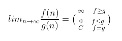
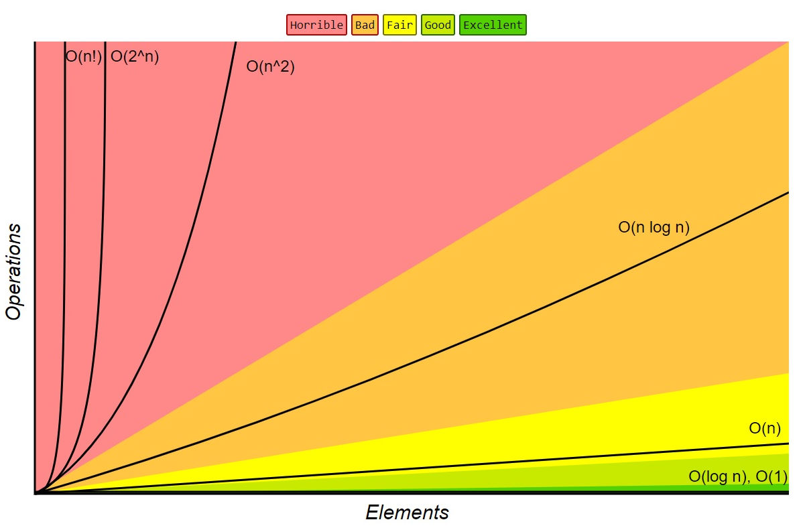

# Сложност и алгоритми. Алгоритми за търсене и сортиране

## Какво е сложност на алгоритъм?

Сложността на алгоритъм е функция, която описва как се променя използваният ресурс (време или памет) в зависимост от размера на входните данни.

### Видове сложност
- **Времева сложност (Time Complexity)** - колко време е необходимо на алгоритъма да се изпълни.
- **Пространствена сложност (Space Complexity)** - колко памет използва алгоритъма.

### Примери за размер на входа (N)
- При търсене в масив - N е броят на елементите в масива.
- При проверка дали число е просто - N е самото число.
- При обработка на стринг - N е дължината на стринга.

> **Важно:** При анализа на алгоритми **НЕ се интересуваме от точната функция**! Интересуваме се само от **асимптотиката** на функцията - т.е. колко бързо расте функцията при **n → ∞**.

## Big O нотация (O-нотация)

### Какво е Big O?

**Big O** нотацията е математически начин да опишем **асимптотичната горна граница** на растежа на една функция. Тя ни казва как **най-лошо** може да се държи алгоритъмът при много големи входни данни.

### Дефиниция

Казваме, че **f(n) = O(g(n))**, ако съществуват константи **c > 0** и **n₀ > 0**, такива че:

$$f(n) \leq c \cdot g(n), \text{ за всяко } n \geq n_0$$

Това означава, че функцията **f(n)** расте **не по-бързо** от **g(n)**, игнорирайки константи и малки стойности на n.

### Сравнение на функции



> **Забележка:** Релациите за "по-малко" и "по-равно" тук **не са същите** като математическите. Тук визираме **скоростта на растежа** на функцията.

### Как се изчислява Big O?

#### Правила за изчисляване
- Игнорирай константите
   - O(2n) → O(n)
   - O(500) → O(1)
   - O(13n²) → O(n²)
- Вземи само доминиращия член
   - O(n² + n) → O(n²)
   - O(n² + 100n + 50) → O(n²)
   - O(n log n + n) → O(n log n)
- Различни променливи - различни термини
   - O(a + b) остава O(a + b)
   - O(a × b) остава O(a × b)

#### Примери за изчисляване

```c++
// Пример 1: O(n)
void example1(size_t n)
{
    for (size_t i = 0; i < n; i++)  // n итерации
    {
        // константна операция
    }
}
// Сложност: O(n)
```

```c++
// Пример 2: O(n²)
void example2(size_t n)
{
    for (size_t i = 0; i < n; i++)      // n итерации
    {
        for (size_t j = 0; j < n; j++)  // n итерации за всяко i
        {
            // константна операция
        }
    }
}
// Сложност: O(n × n) = O(n²)
```

```c++
// Пример 3: O(log n)
void example3(size_t n)
{
    for (size_t i = 1; i < n; i *= 2)  // log₂(n) итерации
    {
        // константна операция
    }
}
// Сложност: O(log n)
```

```c++
// Пример 4: O(n log n)
void example4(size_t n)
{
    for (size_t i = 0; i < n; i++)      // n итерации
    {
        for (size_t j = 1; j < n; j *= 2)  // log₂(n) итерации
        {
            // константна операция
        }
    }
}
// Сложност: O(n × log n) = O(n log n)
```

```c++
// Пример 5: O(n²) - Внимание със strlen()!
void example5(const char* str)
{
    for (size_t i = 0; i < strlen(str); i++)  // strlen() се извиква n пъти!
    {
        // константна операция
    }
}
// Сложност: O(n × n) = O(n²), защото strlen() е O(n)
// Решение: Запази дължината в променлива преди цикъла
```

### Йерархия на сложностите (от най-добра към най-лоша)

| Big O | Име | Пример алгоритъм |
|-------|-----|------------------|
| O(1) | Константна | Достъп до елемент в масив по индекс |
| O(log n) | Логаритмична | Binary Search |
| O(n) | Линейна | Linear Search, обхождане на масив |
| O(n log n) | Линейно-логаритмична | Merge Sort, Quick Sort (average) |
| O(n²) | Квадратична | Bubble Sort, Selection Sort, Insertion Sort |
| O(n³) | Кубична | Наивно умножение на матрици |
| O(2ⁿ) | Експоненциална | Recursive Fibonacci (наивна версия) |
| O(n!) | Факториелна | Генериране на всички пермутации |



### Best, Average, Worst Case

Всеки алгоритъм може да има различна сложност в зависимост от входните данни:

- **Best Case (Ω)** - най-добрият сценарий.
- **Average Case (Θ)** - средният сценарий.
- **Worst Case (O)** - най-лошият сценарий.

> **Обикновено анализираме Worst Case**, защото ни дава гаранция за максималното време на изпълнение.

## Алгоритми за търсене

### Linear Search (Линейно търсене)

Обхождаме масива последователно от начало до край.
- **Времева сложност:** O(n)
- **Пространствена сложност:** O(1)
- **Предимства:** Работи и върху несортирани масиви
- **Недостатъци:** Бавен при големи масиви

### Binary Search (Двоично търсене)

Работи **само върху сортирани масиви**. Всяка стъпка намалява областта на търсене наполовина.
- **Времева сложност:** O(log n)
- **Пространствена сложност:** O(1)
- **Предимства:** Много бърз при големи масиви
- **Недостатъци:** Изисква сортиран масив

### Lower Bound Binary Search**

Намира **първото срещане** на елемент в сортиран масив.
- **Времева сложност:** O(log n)
- **Пример:** В масив [1, 2, 2, 2, 3, 5] търсим 2 → връща индекс **1**

### Upper Bound Binary Search

Намира **последното срещане** на елемент в сортиран масив.
- **Времева сложност:** O(log n)
- **Пример:** В масив [1, 2, 2, 2, 3, 5] търсим 2 → връща индекс **3**

## Алгоритми за сортиране

> **Визуализация:** Вижте как работят алгоритмите нагледно на [VisualGo](https://visualgo.net/en/sorting)

### Какво е стабилна сортировка?

**Стабилна сортировка** е сортировка, при която **два елемента с еднакви стойности** остават в **същата последователност** в сортирания масив, в каквато са били и в първоначалния.

**Пример:**
- Вход: [(5,A), (3,B), (5,C), (1,D)]
- **Стабилна:** [(1,D), (3,B), (5,A), (5,C)] - (5,A) е преди (5,C)
- **Нестабилна:** [(1,D), (3,B), (5,C), (5,A)] - редът на петиците е сменен

---

### Bubble Sort (Сортиране с балончета)

Сравнява съседни елементи и ги разменя, ако са в грешен ред. "Изплува" най-големият елемент към края.

| Характеристика | Стойност |
|---------------|----------|
| **Best Case** | O(n) - вече сортиран масив |
| **Average Case** | O(n²) |
| **Worst Case** | O(n²) |
| **Space Complexity** | O(1) |
| **Стабилност** | Стабилна |

---

### Selection Sort (Сортиране чрез избор)

Намира минималния елемент и го поставя в началото. Повтаря за останалата част от масива.

| Характеристика | Стойност |
|---------------|----------|
| **Best Case** | O(n²) |
| **Average Case** | O(n²) |
| **Worst Case** | O(n²) |
| **Space Complexity** | O(1) |
| **Стабилност** | Нестабилна |

### Insertion Sort (Сортиране чрез вмъкване)

Взема елемент и го вмъква на правилната позиция в сортираната част от масива.

| Характеристика | Стойност |
|---------------|----------|
| **Best Case** | O(n) - вече сортиран масив |
| **Average Case** | O(n²) |
| **Worst Case** | O(n²) |
| **Space Complexity** | O(1) |
| **Стабилност** | Стабилна |
| **Предимство** | Ефективна за малки масиви и почти сортирани данни |

### Counting Sort (Сортиране чрез броене)

Използва допълнителен масив за броене на срещанията на всеки елемент. Работи само с **цели числа в ограничен диапазон**.

| Характеристика | Стойност |
|---------------|----------|
| **Best Case** | O(n + k) |
| **Average Case** | O(n + k) |
| **Worst Case** | O(n + k) |
| **Space Complexity** | O(k) |
| **Стабилност** | Зависи от имплементацията (горният пример е нестабилна) |

*Където k е диапазонът на стойностите*

## Сравнителна таблица на алгоритмите за сортиране

| Алгоритъм | Best | Average | Worst | Space | Стабилност |
|-----------|------|---------|-------|-------|------------|
| **Bubble Sort** | O(n) | O(n²) | O(n²) | O(1) | ✅ |
| **Selection Sort** | O(n²) | O(n²) | O(n²) | O(1) | ❌ |
| **Insertion Sort** | O(n) | O(n²) | O(n²) | O(1) | ✅ |
| **Counting Sort** | O(n+k) | O(n+k) | O(n+k) | O(k) | ⚠️ |

---

## Полезни ресурси

- [Big O Cheat Sheet](https://www.bigocheatsheet.com/) - Справочник за сложности на структури от данни и алгоритми
- [VisualGo](https://visualgo.net/en/sorting) - Интерактивна визуализация на алгоритми за търсене и сортиране
- [Solutions](Solutions/) - Примерни имплементации на разгледаните алгоритми
